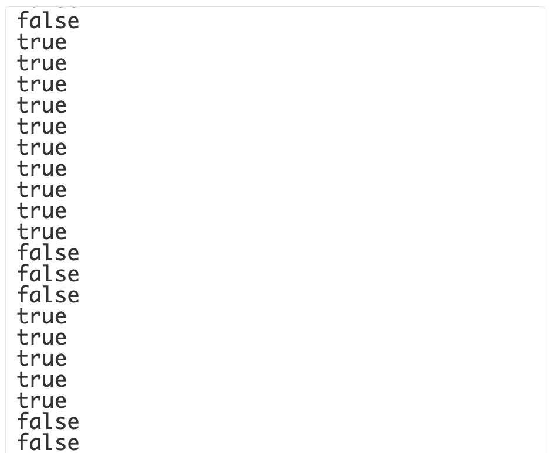
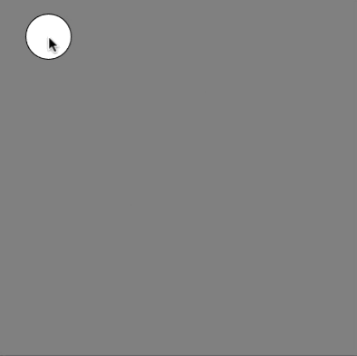

# Link to video.

### Booleans

There are two **Boolean values**: `true` and `false`. Although they are words, they are not strings (there are no quotation marks around them). The word "Boolean" is named after George Boole, a logician from the 1800s. 

The variable `mouseIsPressed` is an example of a built-in Boolean variables in P5.js. `mouseIsPressed` is `true` when the mouse is currently being held down, and `false` otherwise.

```js
function draw() {
    print(mouseIsPressed); // continuously prints true or false depending on whether the mouse is being pressing down
}
```



### Conditionals

The simplest type of conditional structure is called an **if statement**, which uses the keyword `if`.

Here is an example of an `if` statement. This draws circles where the cursor is, but only when the mouse is pressed down.

```js
function setup() {
  createCanvas(windowWidth, windowHeight);
}

function draw() {
  if (mouseIsPressed) { 
    ellipse(mouseX, mouseY, 50, 50); // the circles only show up when the mouse is being pressed down
  }
}
```



If we want the opposite value of a Boolean, we can use the **NOT operator**, which is the exclamation mark symbol `!`.

This is a slight modification of the previous example. This draws a circle where the cursor is, but only when the mouse is NOT being held down.

```js
function setup() {
  createCanvas(windowWidth, windowHeight);
}

function draw() {
  if (!mouseIsPressed) { 
    ellipse(mouseX, mouseY, 50, 50); // the circles only show up when the mouse is NOT pressed down
  }
}
```
