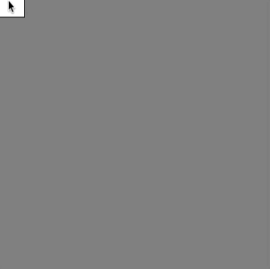

# Link to video.

### Conditionals

Previously we saw how to use the conditional keyword `if`. Another conditional keyword is `else`, which is used alongside `if`. 

An `else` block only runs when the previous `if` condition was not met. We can think of it like the word "otherwise". Here is an example that draws circles when the mouse is pressed down and otherwise draws squares.

```js
function setup() {
    createCanvas(400, 400);
    background(128);
    rectMode(CENTER);
}

function draw() {
    if (mouseIsPressed) { 
        ellipse(mouseX, mouseY, 50); // the circles show up when the mouse is pressed down
    } else {
        rect(mouseX, mouseY, 50, 50); // the squares show up when the mouse is not pressed down
    }
}
```



If we have two or more conditions, we can use `else if` after the first `if`.

```js
const ONE = 49;
const TWO = 50;
const THREE = 51;

function setup() {
    createCanvas(400, 400);
    background(128);
    rectMode(CENTER);
}

function draw() {
    fill(0); // the default colour is black
    if (keyIsDown(ONE)) {
        fill(0, 100, 0); // ONE changes the colour to dark green
    } else if (keyIsDown(TWO)) {
        fill(0, 180, 0); // TWO changes the colour to medium green
    } else if (keyIsDown(THREE)) {
        fill(0, 255, 0); // THREE changes the colour to light green
    }
    ellipse(random(width), random(height), 50);
}
```


