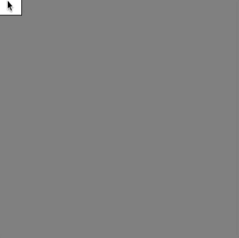

# Link to video.

### Conditionals

Previously we saw how to use the conditional keyword `if`. Another conditional keyword is `else`, which is used alongside `if`. 

An `else` block only runs when the previous `if` condition was not met. We can think of it like the word "otherwise". Here is an example that draws circles when the mouse is pressed down and otherwise draws squares.

```js
function setup() {
    createCanvas(400, 400);
    background(128);
    rectMode(CENTER);
}

function draw() {
    if (mouseIsPressed) { 
        ellipse(mouseX, mouseY, 50); // the circles show up when the mouse is pressed down
    } else {
        rect(mouseX, mouseY, 50, 50); // the squares show up when the mouse is not pressed down
  }
}
```


