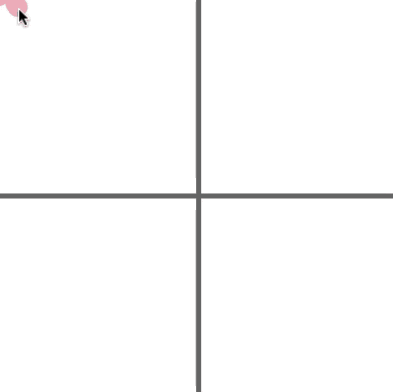

# [Link to video.](https://www.youtube.com/watch?v=SD1ZOXSjstg&list=PLVD25niNi0BnaCreJK38l1-MVGhOFi4Mh)

### Comparisons

We can use these comparison operators to create Boolean expressions:

* less than: `<`
* less than or equal to: `<=`
* greater than: `>`
* greater than or equal to: `>=`

`<=` is supposed to look like the ≤ symbol and `>=` is supposed to look like the ≥ symbol.

### Equality

We can use these equality operators to create Boolean expressions:

* equal to: `==` 
* not equal to: `!=`

`!=` is supposed to look like the ≠ symbol.

In JavaScript, we also have `===` and `!==` when we want to ensure that the two values belong to the same data type. For now we can stick with `==` and `!=`.


### Combinations

Boolean operators combine two or more Boolean expressions to produce a `true` or `false` statement. 

* not: `!`
* and: `&&`
* or: `||` 


### Quadrants

Here are the conditions for the four quadrants:


This example draws different coloured circles depending on where the cursor is. It first checks whether it's in the top-left quadrant, then if it isn't there it checks the top-right quadrant, and if it's not there it can deduce that it's in the bottom half.

```js
function setup() {
    createCanvas(400, 400);
    background(250);
    stroke(100); // grey
    strokeWeight(5);
    line(0, height/2, width, height/2); // draws lines to separate the canvas into quarters
    line(width/2, 0, width/2, height);
    ellipseMode(CENTER);
    noStroke();
}

function draw() {
    ellipse(mouseX, mouseY, 20);
    if (mouseX <= width/2 && mouseY <= height/2) { // if the cursor is in the top-right quarter
        fill(247, 168, 184); // amaranth pink
    } else if (mouseX >= width/2 && mouseY <= height/2) { // if the cursor is in the top-left quarter
        fill(85, 205, 252); // maya blue
    } else { // if the cursor is in the bottom half
        fill(244, 241, 134); // soft yellow
    }
}
```


