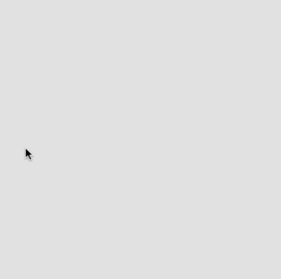

# Link to video.

### Arrays

Each item in an array is always assigned an **index**. The index tells us which position the item is at. The first position is index 0, the second position is index 1, the third position is index 2, and so on. The plural of index is **indices** or **indexes**.

**In computer science, we often start counting at 0 instead of 1**. Being "off by one" is a common phenomenon when programming.

When we want to access an item in an array, we can do that by calling the name of the array and putting the item's index in square brackets. For example:

```js
function setup() {
    let numbers = [10, 20, 30, 40, 50];  // an array
    print(numbers[1])  // prints 20
}
```

Suppose we want coloured circles to show up in a specific order. We can use an array to store the colours and their indices to access them in order. 

Here is the [full list of colour names](https://www.w3schools.com/colors/colors_names.asp) that are recognized by JavaScript.

```js
let colours = ["red", "orange", "yellow", "green", "blue", "indigo", "violet"];
let index = 0;

function setup() {
    createCanvas(windowWidth, windowHeight);
    frameRate(10);
    noStroke();
}

function draw() {
    fill(colours[index]); // this works until we run out of items in the list
    ellipse(mouseX, mouseY, 50);
    index++;
}
```


The program above breaks when we reach the end of the array since `index` is out of range. We can make the colours loop by setting `index` back to `0` when it reaches the end.
```js
let colours = ["red", "orange", "yellow", "green", "blue", "indigo", "violet"];

function setup() {
    createCanvas(windowWidth, windowHeight);
    frameRate(10);
    index = 0;
    noStroke();
}

function draw() {
    fill(colours[index]); // this works until we run out of items in the list
    ellipse(mouseX, mouseY, 50);
    index++;
    if (index == colours.length) {
        index = 0; // ensures the index doesn't go out of range
    }
}
```


