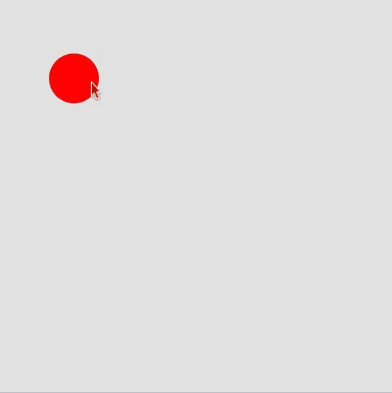

# Link to video.

### Arrays

Suppose we want coloured circles to show up in a specific order. We can use an array to store the colours and their indices to access them in order. 

Here is the [full list of colour names](https://www.w3schools.com/colors/colors_names.asp) that are recognized by JavaScript.

```js
let colours = ["red", "orange", "yellow", "green", "blue", "indigo", "violet"];
let index = 0;

function setup() {
    createCanvas(windowWidth, windowHeight);
    frameRate(10);
    noStroke();
}

function draw() {
    fill(colours[index]); // this works until we run out of items in the list
    ellipse(mouseX, mouseY, 50);
    index++;
}
```


The program above breaks when we reach the end of the array since `index` is out of range. We can make the colours loop by setting `index` back to `0` when it reaches the end.
```js
let colours = ["red", "orange", "yellow", "green", "blue", "indigo", "violet"];

function setup() {
    createCanvas(windowWidth, windowHeight);
    frameRate(10);
    index = 0;
    noStroke();
}

function draw() {
    fill(colours[index]); // this works until we run out of items in the list
    ellipse(mouseX, mouseY, 50);
    index++;
    if (index == colours.length) {
        index = 0; // ensures the index doesn't go out of range
    }
}
```


