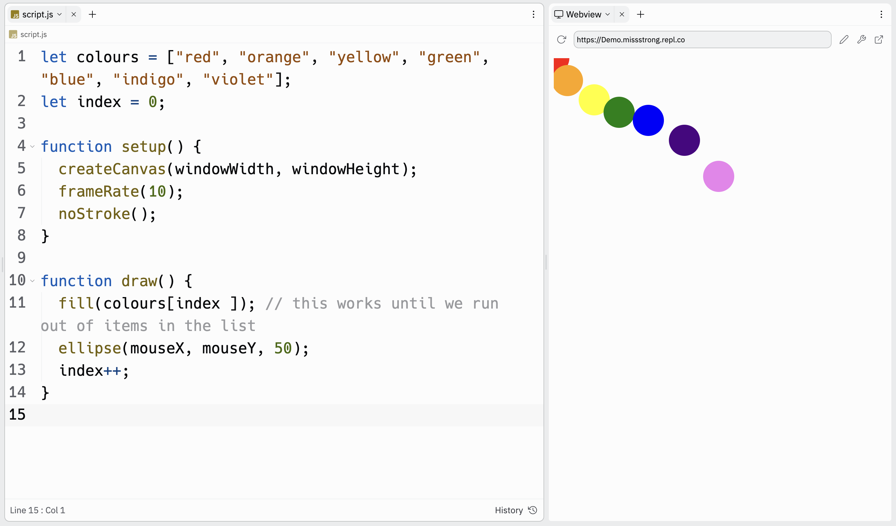

# Link to video.

### Arrays

Suppose we want coloured circles to show up in a specific order. We can use an array to store the colours and their indices to access them in order. 

Here is the [full list of colour names](https://www.w3schools.com/colors/colors_names.asp) that are recognized by JavaScript.

```js
let colours = ["red", "orange", "yellow", "green", "blue", "indigo", "violet"];
let index = 0;

function setup() {
    createCanvas(windowWidth, windowHeight);
    frameRate(10);
    noStroke();
}

function draw() {
    fill(colours[index]); // this works until we run out of items in the list
    ellipse(mouseX, mouseY, 50);
    index++;
}
```


The program above breaks when we reach the end of the array since `index` is out of range. Suppose we want to fix that setting `index` back to `0` when it reaches the end. One way to do that would be use a conditional statement.

```js
let colours = ["red", "orange", "yellow", "green", "blue", "indigo", "violet"];

function setup() {
    createCanvas(windowWidth, windowHeight);
    frameRate(10);
    index = 0;
    noStroke();
}

function draw() {
    fill(colours[index]);
    ellipse(mouseX, mouseY, 50);
    if (index < colours.length) {
      index++;
    } else {
      index = 0; // ensures the index doesn't go out of range
    }
  }
```


### Modulo Operator

A more common approach to prevent an array index from going out of range is to use the **modulo operator**, `%`. It uses the percent sign, but it has nothing to do with percentage. 
The modulo operator is used to get the remainder when an integer is divided by another integer.

```js
function setup() {
    print(8 % 5) // prints 3 since 8 ÷ 5 is 1 remainder 3
    print(23 % 5) // prints 3 since 23 ÷ 5 is 4 remainder 3
}
```

The modulo operator only returns integers between *0* and *n-1* when we do `% n` on a positive integer. If we let *n* be the length of an array, we can ensure that the index never goes out of range.

```js
let colours = ["red", "orange", "yellow", "green", "blue", "indigo", "violet"];

function setup() {
    createCanvas(windowWidth, windowHeight);
    frameRate(10);
    index = 0;
    noStroke();
}

function draw() {
    fill(colours[index % colours.length]); // this repeatedly goes through the colours in the list
    ellipse(mouseX, mouseY, 50);
    index++;
}
```


### Modulo with negative numbers

If we use the modulo operator on a negative integer, we get a non-positive integer (negative or 0). 

```js
function setup() {
    print(-8 % 5) // prints -3
    print(-23 % 5) // prints -3
}
```

To get a positive result, repeatedly add `n` to make it positive before doing `% n`.
