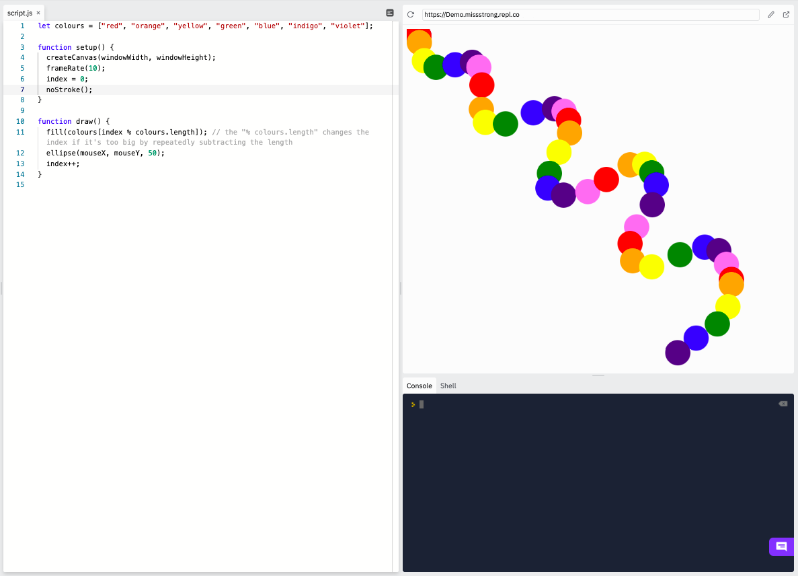

### Arrays

Each item in an array is assigned an **index**. The index tells us which position the item is at. The first position is index 0, the second position is index 1, the third position is index 2, and so on. The plural of index is **indices** or **indexes**.

**In computer science, we often start counting at 0 instead of 1**. Being "off by one" is a common phenomenon when programming.

When we want to access an item in an array, we can do that by calling the name of the array and putting the item's index in square brackets. For example:

```js
function setup() {
  let numbers = [10, 20, 30, 40, 50];  // an array
  print(numbers[1])  // prints 20
}
```

An array is a type of **object**. Objects have **properties** (variables) and **methods** (functions). To access properties and methods, we use **dot notation** (`objectName.property` or `objectName.method()`).

We can get the number of items in an array using the `length` property. 

```js
function setup() {
  let numbers = [10, 20, 30, 40, 50]; 
  let length = numbers.length // the number of items in the array
  print(length)  // prints 5
  print(numbers[length - 1])  // prints the last number in the array, 50
}
```

We can find the index of an array using the `indexOf()` method.

```js
function setup() {
  let numbers = [10, 20, 30, 40, 50]; 
  print(numbers.indexOf(30))  // prints 2
  print(numbers.indexOf(50))  // prints 4
  print(numbers.indexOf(60))  // prints -1 (which means it's not in the array)
}
```

Suppose we want to coloured circles to show up in a specific order. We can use an array to store the colours and their indices to access them in order.

```
let colours = ["red", "orange", "yellow", "green", "blue", "indigo", "violet"];

function setup() {
  createCanvas(windowWidth, windowHeight);
  frameRate(10);
  index = 0;
  noStroke();
}

function draw() {
  fill(colours[index % colours.length]); // the "% colours.length" changes the index if it's too big by repeatedly subtracting the length
  ellipse(mouseX, mouseY, 50);
  index++;
}
```


