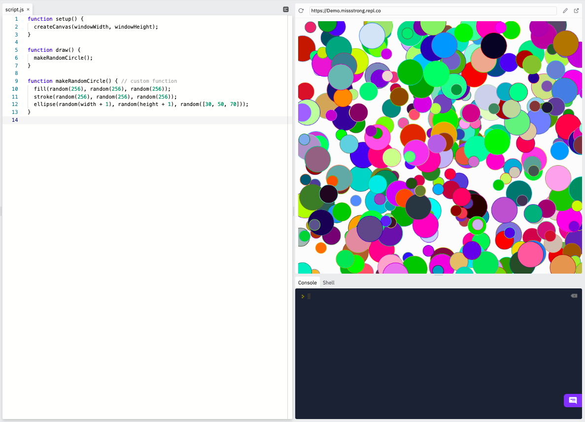
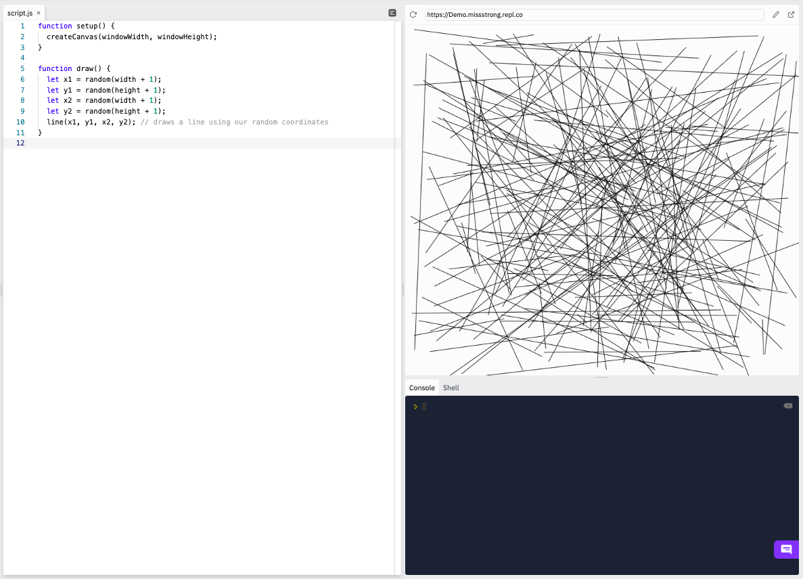
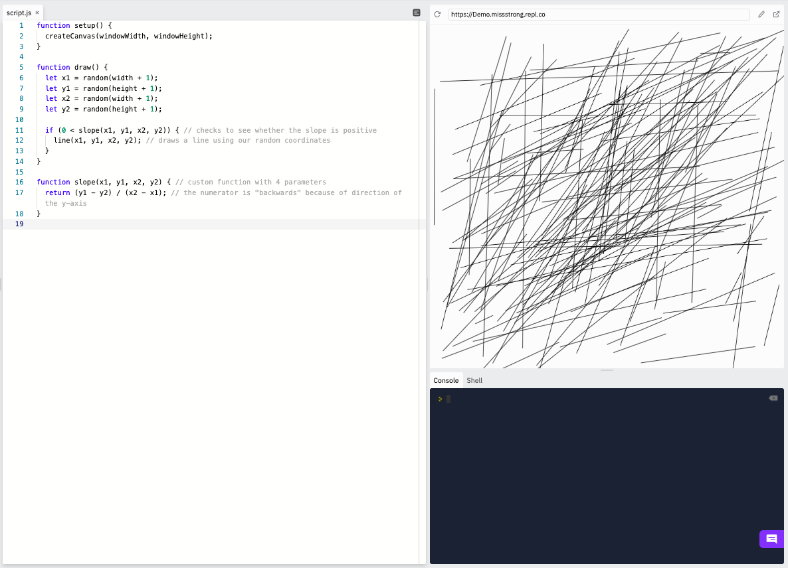

### Functions

A function performs a sequence of steps used to accomplish a task. There are 289 functions that are built-in to P5.js. We can see them all on the [P5.js Reference Page](https://p5js.org/reference/). Here are just a few examples:

*  `setup()` is a function that is used to set up the canvas in its initial state 
*  `ellipse()` is a function used to draw an ellipse on the canvas
*  `fill()` is a function used to indicate what colour to fill in shapes and text
*  `random()` is a function that is used to generate a random value

Some functions sometimes require *inputs*, called **parameters** or **arguments**. For example, the `rect()` function draws a rectangle, but you have to tell it where on the canvas it goes and what the dimensions are. Some functions do different things depending on the number of arguments and their data types. For example `fill()` can take one number for a monochrome colour, three numbers for an RGB colour, or four number for an RBG colour with some transparency.

Some functions provide an *output*, called a **return value**. For example, `random()` outputs a random value for you to use.

### Custom Functions

We can create our own functions for us to use. This is a convenient thing to do when we have the same lines of code repeated many times throughout our program. 

```js
function setup() {
  createCanvas(windowWidth, windowHeight);
}

function draw() {
  makeRandomCircle(); // calling our custom function
}

function makeRandomCircle() { // custom function
  fill(random(256), random(256), random(256));
  stroke(random(256), random(256), random(256));
  ellipse(random(width + 1), random(height + 1), random([30, 50, 70]));
}
```



We can alse functions to perform calculations for us. Suppose we want a program that draws random lines with positive slopes.

The program below draws lines at random, which have negative, zero, or positive slopes.

```js
function setup() {
  createCanvas(windowWidth, windowHeight);
}

function draw() {
  let x1 = random(width + 1); 
  let y1 = random(height + 1); 
  let x2 = random(width + 1); 
  let y2 = random(height + 1); 
  line(x1, y1, x2, y2); // draws a line using our random coordinates
}
```



We can create a function that calculates the slope of a line and we can use that to draw only lines with positive slopes. Since we need to know the two coordinates in order to calculate the slope, we need parameters for them.

```js
function setup() {
  createCanvas(windowWidth, windowHeight);
}

function draw() {
  let x1 = random(width + 1); 
  let y1 = random(height + 1); 
  let x2 = random(width + 1); 
  let y2 = random(height + 1); 

  if (0 < slope(x1, y1, x2, y2)) { // checks to see whether the slope is positive
    line(x1, y1, x2, y2); // draws a line using our random coordinates
  }
}

function slope(x1, y1, x2, y2) { // custom function with 4 parameters
  return (y1 - y2) / (x2 - x1); // the numerator is "backwards" because of direction of the y-axis
}

```


