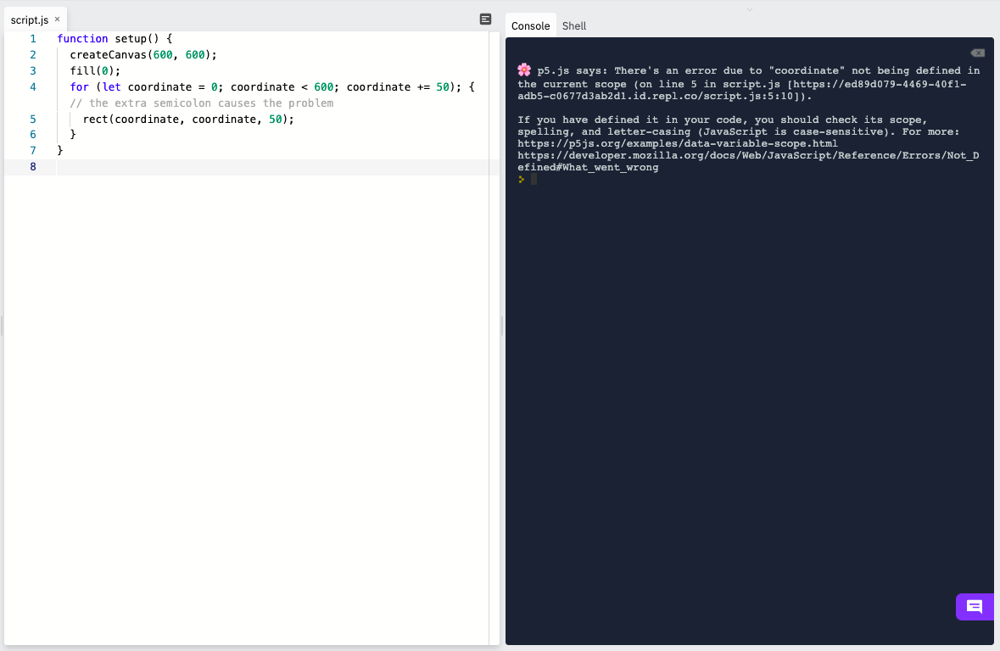

### For Loops

Another type of loop is a *for* loop. The syntax for a *for* loop looks different than a *while* loop, but it contains all the key parts:

* a variable getting initialized
* a boolean expression involving the variable that is repeatedly being checked
* the variable getting updated

Here is the example of a *while* loop from before with the three key parts shown.

```js
let coordinate = 0; // the coordinate variable is getting initialized

function setup() {
  createCanvas(600, 600);
  fill(0);
  while (coordinate < 600) { // we're checking if the coordinate is still less than 600
    rect(coordinate, coordinate, 50); 
    coordinate += 50 // the coordinate variable is getting updated
  }
}
```

A *for* loop takes these three parts and puts them all on one line, separated by semicolons. The keyword `for` is used.

Here is the example from above rewritten using a *for* loop instead.

```js
function setup() {
  createCanvas(600, 600);
  fill(0);
  for (let coordinate = 0; coordinate < 600; coordinate += 50) { // the three parts are all here
    rect(coordinate, coordinate, 50); 
  }
}
```

Getting the syntax correct is important. For example, putting a semicolon before the curly brace the block to run exactly once.

```js
function setup() {
  createCanvas(600, 600);
  fill(0);
  for (let coordinate = 0; coordinate < 600; coordinate += 50); { // the extra semicolon causes the problem
    rect(coordinate, coordinate, 50); 
  }
}
```


