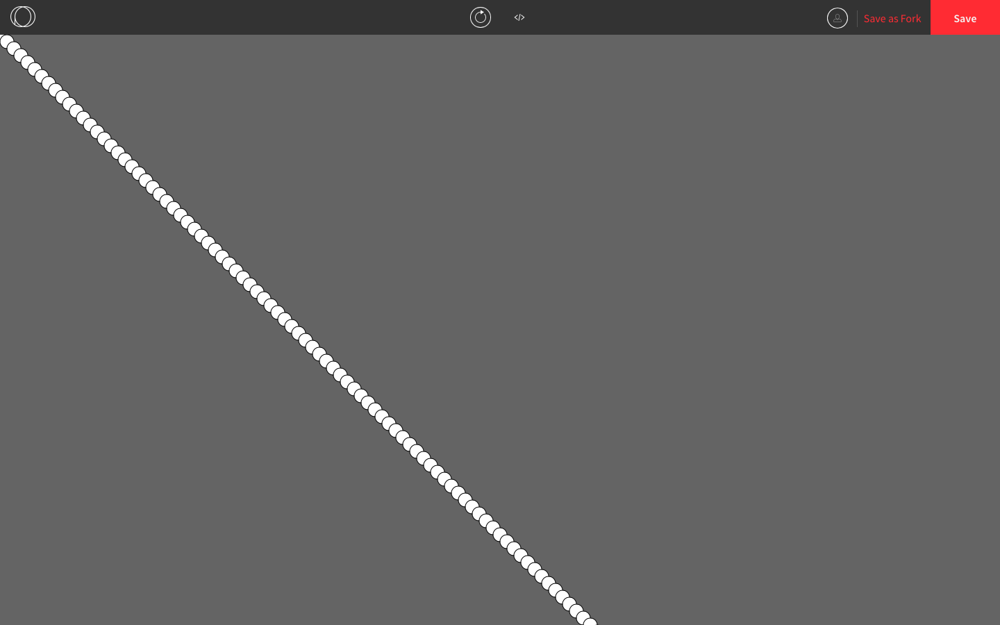
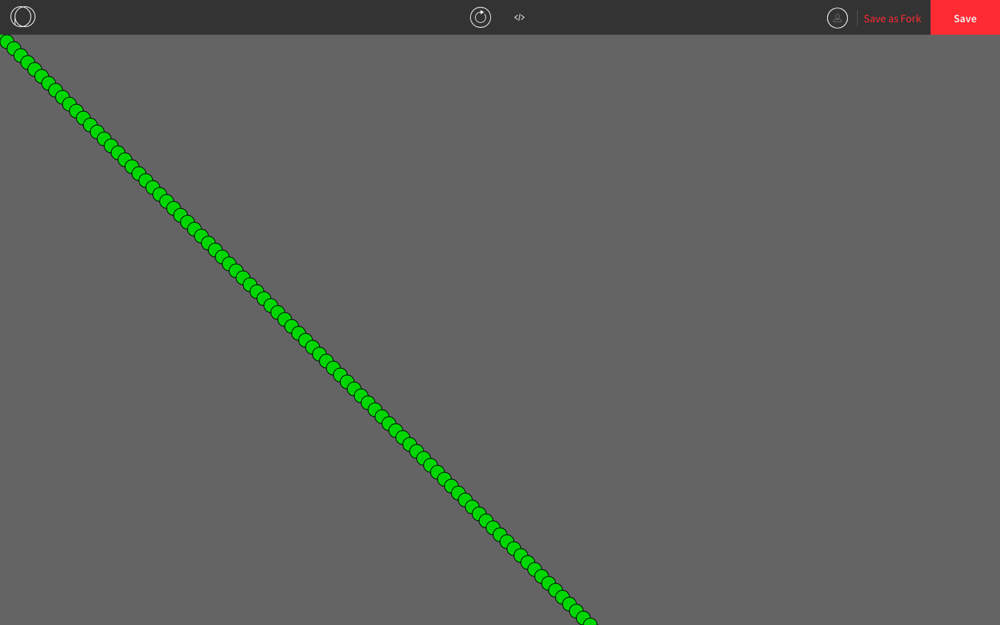

### Custom Objects

Custom objects are useful when we have many variables that are better off grouped together. For example, if we are creating a program that draws circles, we can make a circle object that has properties for its coordinates, size, colours, and any other information.

Here is a program we saw earlier.

```js
let coordinate = 0;

function setup() {
  createCanvas(windowWidth, windowHeight);
  background(100);
}
  
function draw() {
  ellipse(coordinate, coordinate, 20); 
  coordinate += 10; 
}
```



The syntax for a custom object looks like this:

```js
let circle = { // "let" followed by the object name, an equal sign, and an opening brace
  coordinate: 0, // the list of properties, with the key and value separated by a colon
  diameter: 20 
} // a closing brace after all the properties are listed
```

Once we define `circle` like that, we use `circle.coordinate` and `circle.diameter` instead of `coordinate` and `diameter`.

Here's what the program looks like now. It does the same thing as before but now it's easier to read and debug if needed.

```js
let circle = { // circle is an object 
  coordinate: 0,
  diameter: 20
}

function setup() {
  createCanvas(windowWidth, windowHeight);
  background(100);
}
  
function draw() {
  ellipse(circle.coordinate, circle.coordinate, circle.diameter); // dot syntax is used to get the values in the circle object
  circle.coordinate += 10; // increments work on object keys
}
```


We can add more fields if we want, such as the colours of the circle. Since each colour has three properties, we can make the colour an object with three fields. 

```js
let circle = {
  coordinate: 0,
  diameter: 20,
  colour: {
    r: 50,
    g: 205,
    b: 50
  }
}

function setup() {
  createCanvas(windowWidth, windowHeight);
  background(100);
  fill(circle.colour.r, circle.colour.g, circle.colour.b); // dot syntax looks like this when you have an object inside an object
}
  
function draw() {
  ellipse(circle.coordinate, circle.coordinate, circle.diameter); 
  circle.coordinate += 10; 
}
```


