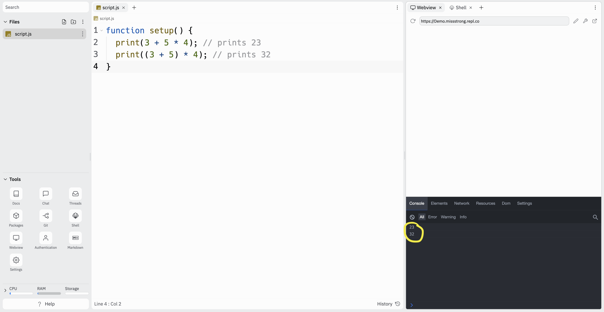
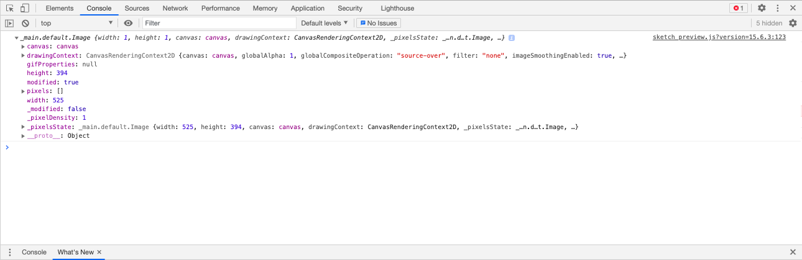

### Image Objects

Here is a program we saw earlier that displays an image onto the canvas.

```js
function preload() {
  doge = loadImage("doge.png");
}

function setup() {
  createCanvas(windowWidth, windowHeight);
  imageMode(CENTER);
  image(doge, windowWidth/2, windowHeight/2, width, height);
}
```

If we call `print(doge)` within `setup()`, here's what shows up in the console:



It tells us that `doge` is an `Object`. 

An **object** is a data type, just like numbers, strings, and booleans. Objects contain **properties**. A property is an association between a **key** and a **value**. For example, one of the properties of `doge` is `"width: 525`, where `width` is the key and `525` is the value.

### Dot Syntax

We can access the properties within an object using **dot syntax** (a.k.a. **dot notation**). We write the object name followed by a dot followed by the key we want to use. This will give us the value that is associated with that key. For example, `doge.width` gives us `525`, and `doge.height` gives us `394` (since the dimensions of the image are 525 pixels by 394 pixels).

If we want to see the full output of `print(doge)` from before, we can right-click in the browser, go to *Inspect Element*, and click on *Console*.



We can see that image objects have many properties and that several of the properties are objects that contain even more properties. That's because the image objects store all in the information needed to display the image, including the colour of each individual pixel. 

### Array Objects

An array is a type of object. That's why we use dot notation for accessing the length and adding or deleting items.

```js
function setup() {
  let numbers = [10, 20, 30, 40, 50]; 
  let length = numbers.length // the number of items in the array
  print(length)  // prints 5
  print(numbers[length - 1])  // prints the last number in the array, 50
  print(numbers.indexOf(30))  // prints 2
  print(numbers.indexOf(50))  // prints 4
  print(numbers.indexOf(60))  // prints -1 (which means it's not in the array)
  numbers.push(60); // puts 60 at the end of the array
  print(numbers); // prints [10, 20, 30, 40, 50, 60]
  numbers.pop(); // removes the 60 at the end of the array
  numbers.pop(); // removes the 50 at the end of the array
  print(numbers); // prints [10, 20, 30, 40]
}
```
