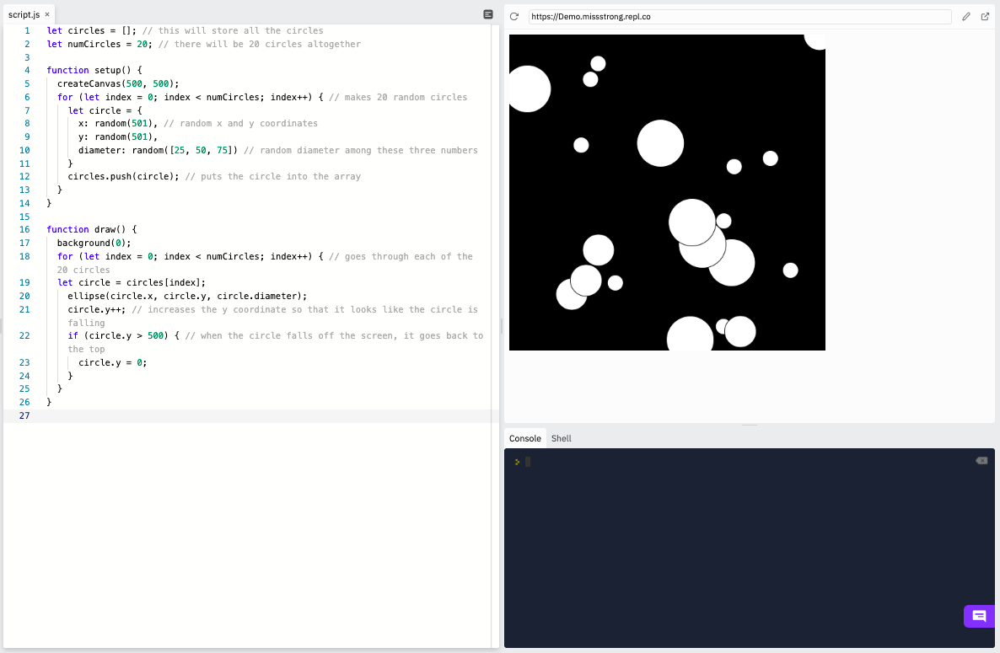
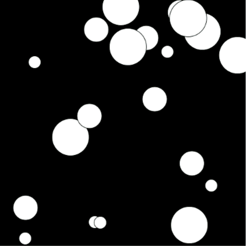

### Modifying Arrays

We can add items to an array or remove items from an array at any point after we initialize it. 

We can add items to the back of the array using the `push()`method. 

```js
function setup() {
  let numbers = [10, 20, 30, 40, 50]; 
  numbers.push(60); // puts 60 at the end of the array
  print(numbers); // prints [10, 20, 30, 40, 50, 60]
}
```

We can remove the last item using the `pop()` method.

```js
function setup() {
  let numbers = [10, 20, 30, 40, 50]; 
  numbers.pop(); // removes the 50 at the end of the array
  print(numbers); // prints [10, 20, 30, 40]
}
```

### Using Arrays to Store Objects

If we wanted several shapes with different properties on our canvas, we can use an array to keep track of each individual one.

For example, this program shows 20 different circles "falling" down.

```js
let circles = []; // this will store all the circles
let numCircles = 20; // there will be 20 circles altogether

function setup() {
  createCanvas(500, 500);
  for (let index = 0; index < numCircles; index++) { // makes 20 random circles
    let circle = {
      x: random(501), // random x and y coordinates
      y: random(501),
      diameter: random([25, 50, 75]) // random diameter among these three numbers
    }
    circles.push(circle); // puts the circle into the array
  }
}

function draw() {
  background(0);
  for (let index = 0; index < numCircles; index++) { // goes through each of the 20 circles
  let circle = circles[index];
    ellipse(circle.x, circle.y, circle.diameter); 
    circle.y++; // increases the y coordinate so that it looks like the circle is falling
    if (circle.y - circle.diameter/2 > 500) { // when the circle falls off the screen, it goes back to the top
      circle.y = 0;
    }
  }
}
```





