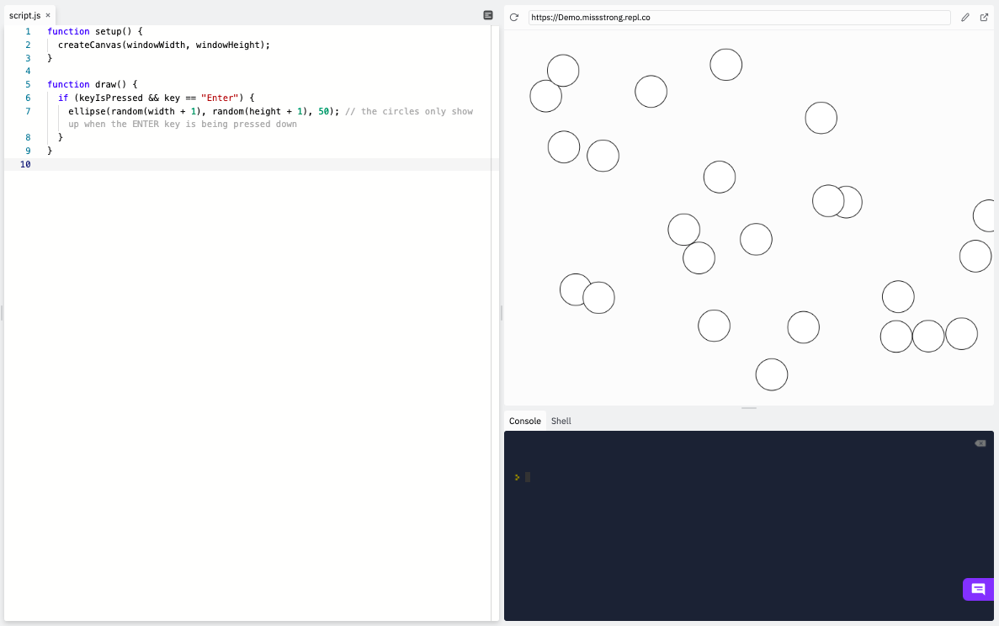

### Keys

Recall that we can determine whether a key is being pressed using the Boolean variable `keyIsPressed`. 

Here's an example from before.

```js
function setup() {
  createCanvas(windowWidth, windowHeight);
}

function draw() {
  if (keyIsPressed) { 
    ellipse(random(width + 1), random(height + 1), 50); // the circles only show up when a key is being pressed down
  }
}
```


If we want to figure out which key is being pressed, we can do that by using the string variable `key`, which stores the most recently pressed key. 
To find the string for a particular key, go to [http://keycode.info](http://keycode.info/), press the key, and look under *key.event*.

According to that webpage, the string for the enter key is `"Enter"` (the capitalization matters). With that information, we can modify the previous example so that the circle is drawn only if the ENTER key is pressed.

```js
function setup() {
  createCanvas(windowWidth, windowHeight);
}

function draw() {
  if (keyIsPressed && key == "Enter") { 
    ellipse(random(width + 1), random(height + 1), 50); // the circles only show up when the ENTER key is being pressed down
  }
}
```


