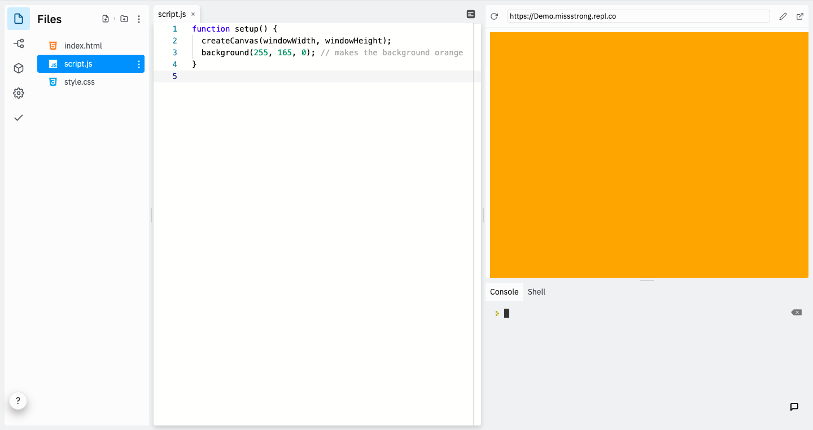
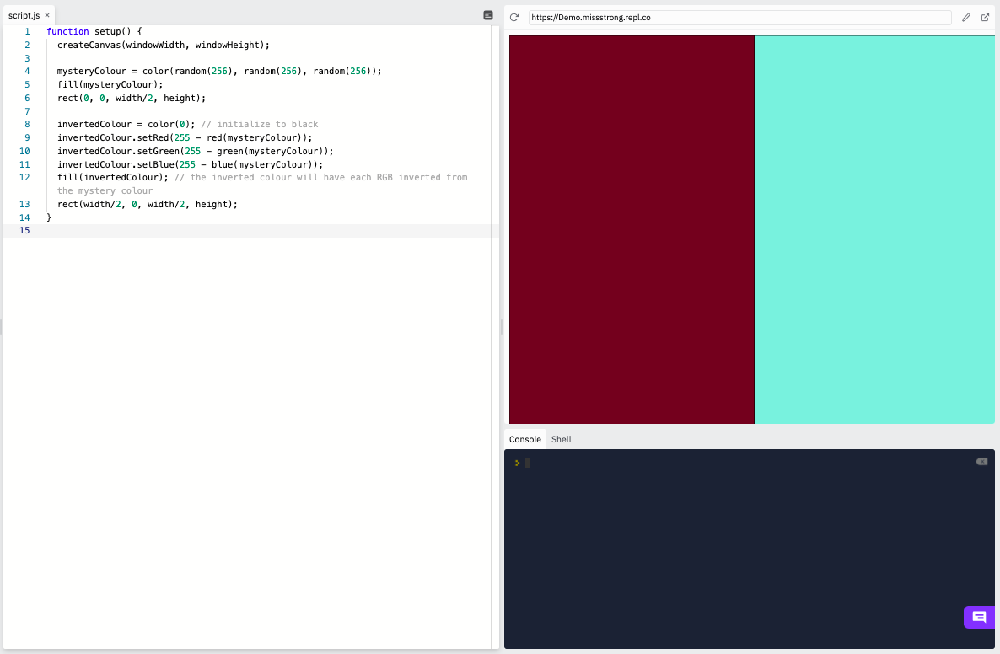

### Colour Objects

So far we've mostly been using RGB values for colours.

```javascript
function setup() {
  createCanvas(windowWidth, windowHeight);
  background(255, 165, 0); // makes the background orange
}
```



We've also seen built-in strings that represent a variety of [colours recognized by HTML/CSS/Javascript](https://www.w3schools.com/colors/colors_names.asp). 


```js
let colours = ["red", "orange", "yellow", "green", "blue", "indigo", "violet"];

function setup() {
  createCanvas(windowWidth, windowHeight);
  frameRate(10);
  index = 0;
  noStroke();
}

function draw() {
  fill(colours[index % colours.length]); 
  ellipse(mouseX, mouseY, 50);
  index++;
}
```


Another possibility is to use the colour's **hexadecimal value**. Hexadecimal is a base-16 number system that uses these 16 digits: 0, 1, 2, 3, 4, 5, 6, 7, 8, 9, A, B, C, D, E, F. A hash sign `#` is often used to indicate a hexadecimal value. 

We can covert an integer from 0 to 255 using two hexadecimal digits, so we can convert an RGB value into six hexadecimal digits. For example, orange's RGB value is (255, 165, 0), which can be written in hexadecimal as `#FFA500` (FF is 255, A5 is 165 and 00 is 0). We can use online decimal to hexadecimal converters to do this work for us.


```javascript
function setup() {
  createCanvas(windowWidth, windowHeight);
  background("#FFA500"); // makes the background orange
}
```

One more possibility is to use a `color` object, whcih is built into P5.js.

```js
function setup() {
  createCanvas(windowWidth, windowHeight);
  orange = color(255, 165, 0); // orange is a color object
  background(orange); // makes the background orange
}
```

We can get the RGB values of a color object using `red()`, `green()`, `blue()` and we can update them using `.setRed()`, `setGreen()`, and `setBlue()`.

```js
function setup() {
  createCanvas(windowWidth, windowHeight);

  mysteryColour = color(random(256), random(256), random(256)); 
  fill(mysteryColour);
  rect(0, 0, width/2, height);
  
  invertedColour = color(0); // initialize to black
  invertedColour.setRed(255 - red(mysteryColour));
  invertedColour.setGreen(255 - green(mysteryColour));
  invertedColour.setBlue(255 - blue(mysteryColour));
  fill(invertedColour); // the inverted colour will have each RGB inverted from the mystery colour
  rect(width/2, 0, width/2, height);
}
```




