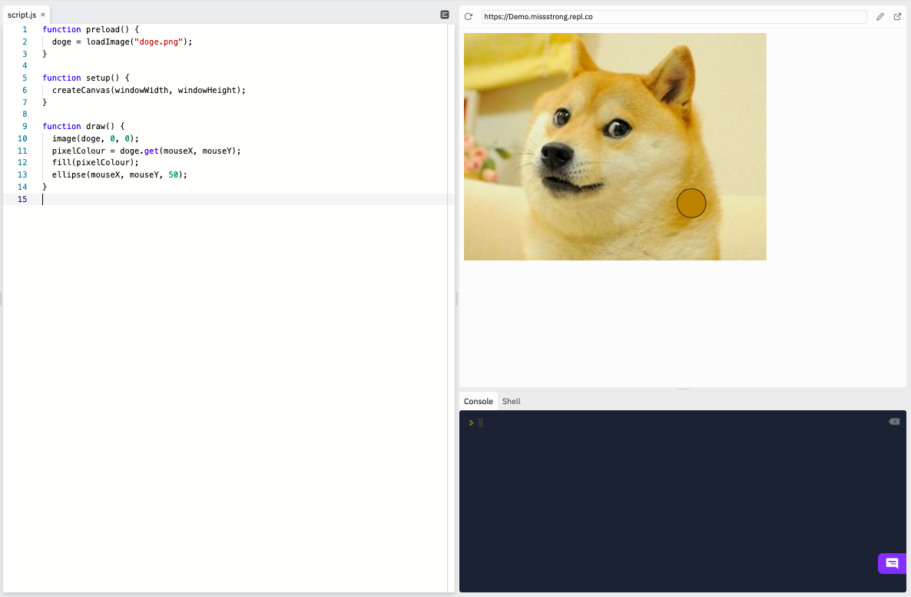
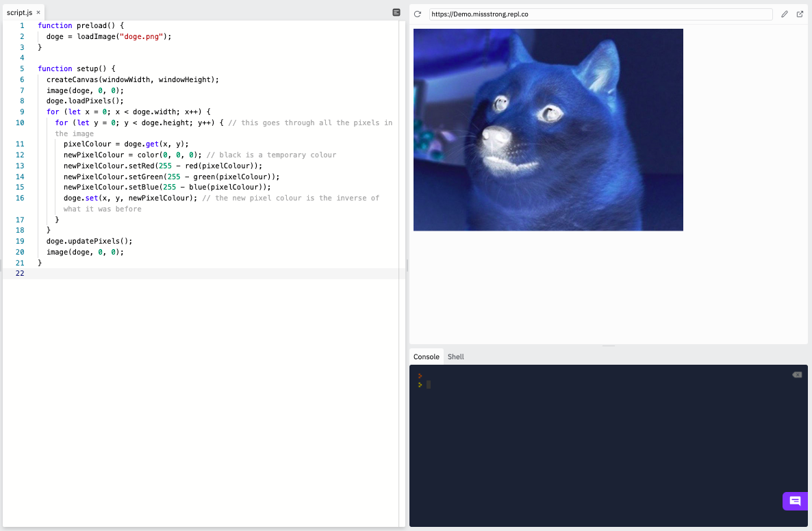

### Image Methods

We can get update the colours of the individual pixels in an image object using `.get()` and `.set()`.


The example below gets the colour of the pixel the mouse is on and magnifies it.

```js
function preload() {
  doge = loadImage("doge.png");
}

function setup() {
  createCanvas(windowWidth, windowHeight);
}

function draw() {
  image(doge, 0, 0);
  pixelColour = doge.get(mouseX, mouseY); // gets the colour of the pixel at (mouseX, mouseY)
  fill(pixelColour);
  ellipse(mouseX, mouseY, 50); // this is like a magnifying glass!
}
```




The example below inverts the colours of all the pixels by changing its RGB values to their inverses (255 minus the original number).

```js
function preload() {
  doge = loadImage("doge.png");
}

function setup() {
  createCanvas(windowWidth, windowHeight);
  image(doge, 0, 0);
  doge.loadPixels();
  for (let x = 0; x < doge.width; x++) {
    for (let y = 0; y < doge.height; y++) { // this goes through all the pixels in the image
      pixelColour = doge.get(x, y);
      newPixelColour = color(0, 0, 0); // black is a temporary colour
      newPixelColour.setRed(255 - red(pixelColour));
      newPixelColour.setGreen(255 - green(pixelColour));
      newPixelColour.setBlue(255 - blue(pixelColour));
      doge.set(x, y, newPixelColour); // the new pixel colour is the inverse of what it was before
    }
  }
  doge.updatePixels();
  image(doge, 0, 0);
}
```


