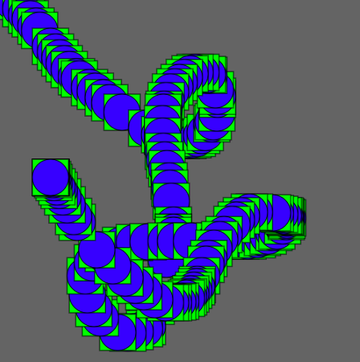
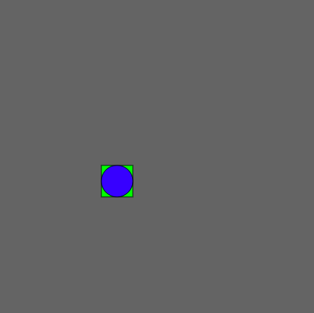
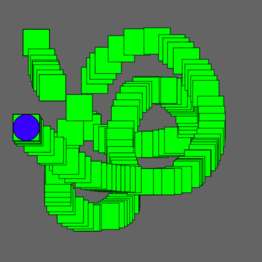
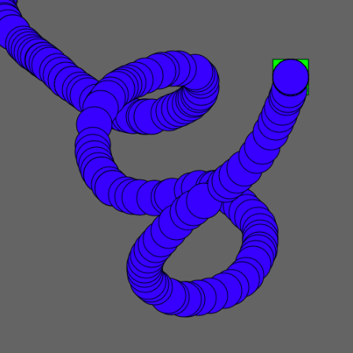

### Trails

Recall that we can leave a trail of shapes by placing `background()` in `setup()` or leave no trail by placing `background()` in `draw()`.

Here is sketch that has a blue circle and a green square following the mouse. Both of them leave a trail.

```javascript
function setup() {
  createCanvas(500, 500);
  rectMode(CENTER);
  background(100); // since background() is in setup(), the shapes leave trails
}

function draw() {
  fill(0, 255, 0); // green for the squares
  rect(mouseX, mouseY, 50)

  fill(0, 0, 255); // blue for the circles
  ellipse(mouseX, mouseY, 50); 
}
```



Here is the same program, but with `background()` moved to `draw()` so that neither shapes leave a trail.

```javascript
function setup() {
  createCanvas(500, 500);
  rectMode(CENTER);
}

function draw() {
  background(100); // since background() is in draw(), the shapes don't leave trails
  
  fill(0, 255, 0); // green for the squares
  rect(mouseX, mouseY, 50)

  fill(0, 0, 255); // blue for the circles
  ellipse(mouseX, mouseY, 50); 
}
```



We're going to see how we can have a sketch with one shape that leaves a trail and another one that doesn't.


### Graphics

A **graphic** object in P5.js is like a canvas. So far we've been putting everything all on one canvas but we can simulate having multiple canvases by creating graphic objects. The function for creating a graphic is `createGraphics()`, which takes two numbers representing its width and height.

A graphic is treated like an image object, so we can put it on the main canvas using `image()`. We can create a graphic whenever we need a layer that has shapes leaves a trail when there are other shapes that don't leave trails. This works for both background layers and foreground layers.

Here is another variation of the examples above. The circle doesn't leave a trail and the rectangles are drawn on a graphic representing the background layer.

```javascript
function setup() {
  createCanvas(500, 500);
  fill(0, 0, 255);
	
  bg = createGraphics(width, height); // the background layer with the squares
  bg.fill(0, 255, 0);
  bg.rectMode(CENTER);
}

function draw() {
  bg.rect(mouseX, mouseY, 50); // put a new square onto the background layer
  
  background(100); // clears the foreground layer to remove the previous blue circle
  image(bg, 0, 0); // puts all the squares on the canvas again
  ellipse(mouseX, mouseY, 50) // put the blue circle on the canvas
}
```



Here is one more variation. The rectangle doesn't leave a trail and circles are drawn on a graphic representing the foreground layer.

```javascript
function setup() {
  createCanvas(500, 500);
  fill(0, 255, 0)
  rectMode(CENTER);
	
  fg = createGraphics(width, height); // the foreground layer with the cirles
  fg.fill(0, 0, 255);
}

function draw() {
  background(100); // clears the background layer to remove the previous green square
  rect(mouseX, mouseY, 50); // put the green square on the canvas

  fg.ellipse(mouseX, mouseY, 50); // put a new circle onto the foreground layer
  image(fg, 0, 0); // puts all the circles on the canvas
}
```


