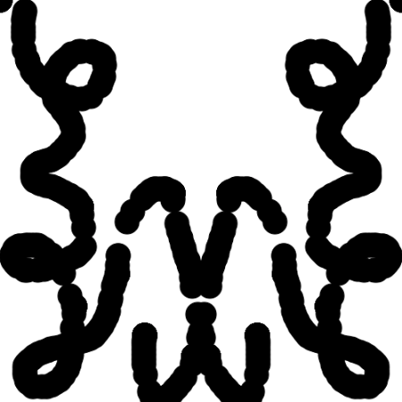

### Duplicating Graphics 

Suppose we want to create a sketch that draws a circle trail mirrored vertically.

One way of doing that is to calculate the location of the two circles and draw them separately.


```javascript
function setup() {
  createCanvas(500, 500);
  background(255); 
  halfWidth = width/2;
  fill(0);
}

function draw() {
  ellipse(halfWidth +  abs(halfWidth - mouseX), mouseY, 30);
  ellipse(halfWidth -  abs(halfWidth - mouseX), mouseY, 30);
}
```




Another way is to place both of them on a graphic, display it twice, and mirror one of them. We can do that since graphics are like image objects.

```javascript
// TODO
```
