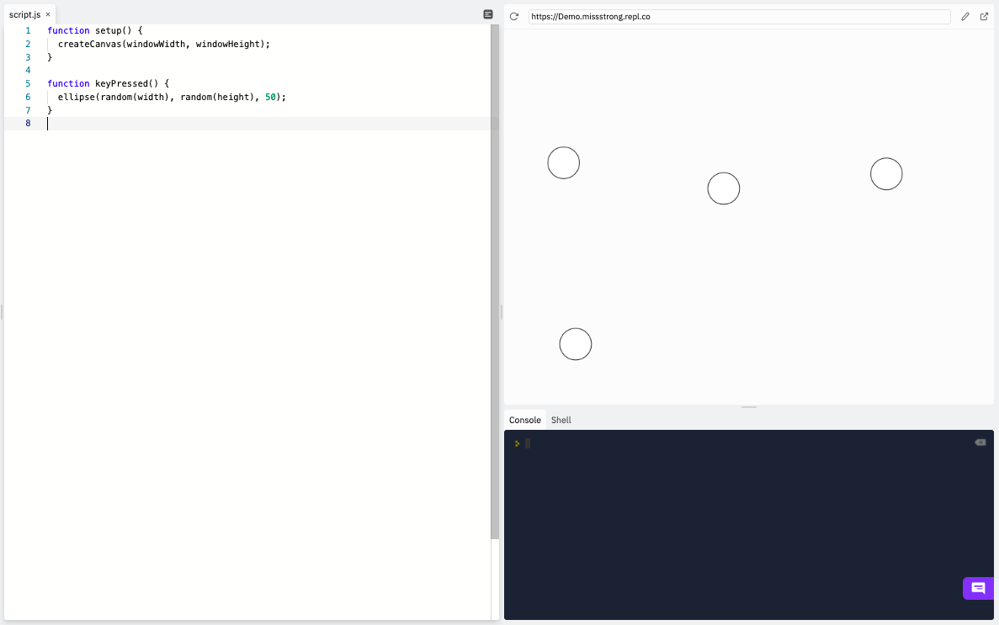
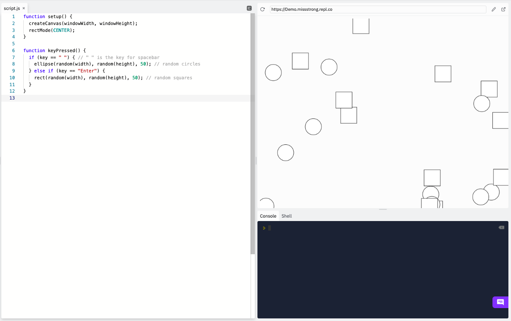

## Key Presses

So far we've seen the built-in variable `keyIsPressed` used to detect whether there is currently any key being pressed down. 

Here's an example from before. It keeps drawing circles when we are pressing down on a key and it stops drawing them when we let go of all the keys.

```js
function setup() {
  createCanvas(windowWidth, windowHeight);
}

function draw() {
  if (keyIsPressed) { 
    ellipse(random(width + 1), random(height + 1), 50); // the circles only show up while a key is being pressed down
  }
}
```


If we want to detect a single key press instead, we can use the `keyPressed()` function. This type of function is called an  **event listener** or an **event handler**, since it gets called as soon as a particular event occurs. In this case, the event is a single key being pressed.

The way we use the `keyPressed()` function is similar to `setup()`, `preload()`, `draw()`.  We are overriding it, so we need the keyword `function` and we fill in the body of the function with what we want to happen when a key is pressed. 

This example draws a circle in a random place each time a key is pressed.

```js
function setup() {
  createCanvas(windowWidth, windowHeight);
}

function keyPressed() {
  ellipse(random(width), random(height), 50);
}
```



We can still use the variable `key` to check which key was pressed. This example draws a circle every time the spacebar is pressed and a square every time the ENTER key is pressed.

```js
function setup() {
  createCanvas(windowWidth, windowHeight);
  rectMode(CENTER);
}

function keyPressed() {
  if (key == " ") { // " " is the key for spacebar
    ellipse(random(width), random(height), 50); // random circles
  } else if (key == "Enter") {
    rect(random(width), random(height), 50); // random squares
  } 
}
```



If we want something to happen when a key is released as opposed to when it's first pressed, we can use `keyReleased()` instead.

This is the same example as before but with `keyPressed()` replaced with `keyReleased()`. The shapes show up when we release the keys.

```js
function setup() {
  createCanvas(windowWidth, windowHeight);
  rectMode(CENTER);
}

function keyPressed() {
  if (key == " ") { // " " is the key for spacebar
    ellipse(random(width), random(height), 50); // random circles
  } else if (key == "Enter") {
    rect(random(width), random(height), 50); // random squares
  } 
}
```
