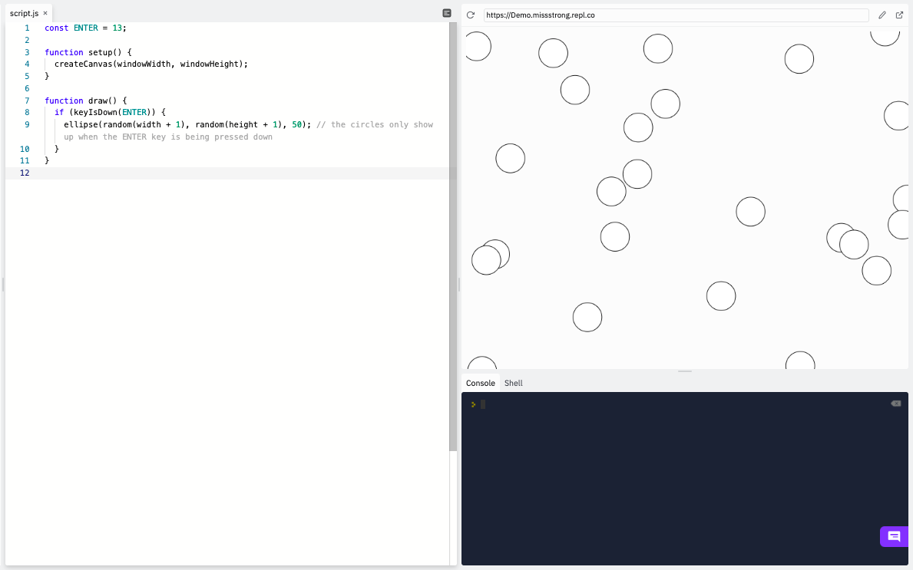

### Keycodes

Recall that we can determine whether there is currently any key being pressed down using the Boolean variable `keyIsPressed`. 

Here's an example from before.

```js
function setup() {
  createCanvas(windowWidth, windowHeight);
}

function draw() {
  if (keyIsPressed) { 
    ellipse(random(width + 1), random(height + 1), 50); // the circles only show up when a key is being pressed down
  }
}
```


If we want to figure out which key was being pressed, we need to learn about **keycodes**. A keycode is a number assigned to each key on the keyboard. To find the keycode for a particular key, go to [http://keycode.info](http://keycode.info/), press the key, and look under *key.code*.

We can use `keyIsDown()` to check which keys are being pressed down. The `keyIsDown()` function takes a number represeneting a keycode and returns `true` if that key is currently being pressed down and `false` otherwise. 

According to [http://keycode.info](http://keycode.info/), the keycode for the enter key is 13. We should make a constant for that so that it's clear what the number 13 is for in case we forget. Now we can modify the previous example so that the circle is drawn only if the enter key is being pressed.

```js
const ENTER = 13;

function setup() {
  createCanvas(windowWidth, windowHeight);
}

function draw() {
  if (keyIsDown(ENTER)) { 
    ellipse(random(width + 1), random(height + 1), 50); // the circles only show up when the ENTER key is being pressed down
  }
}
```


