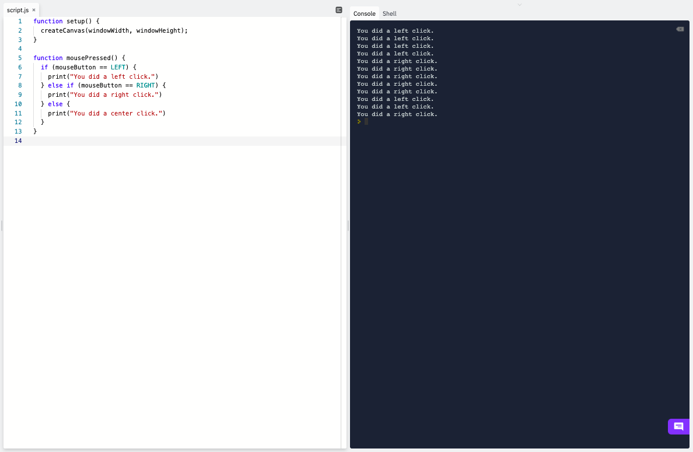
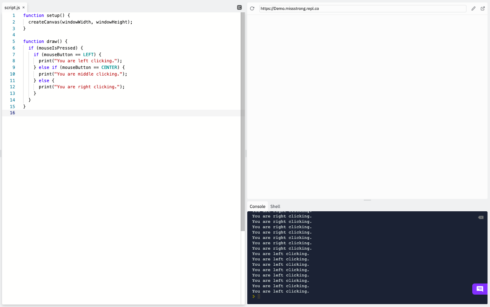

### Mouse Buttons

Recall that when we want something to happen when we do a single mouse click we use the `mousePressed()` or `mouseReleased()` functions and when we want something to happen while the mouse is being pressed down we use the Boolean variable `mouseIsPressed` in a conditional.

If we want to know which mouse button was pressed, we can use the string variable `mouseButton`. It stores the values of `LEFT` (equivalent to `"left"`), `CENTER` (equivalent to `"center"`), or `RIGHT` (equivalent to `"right"`), depending on which one was most recently pressed. On a trackpad, a left click is the same as a one-finger click, a right click is the same as a two-finger click, and a middle click is the same as a three-finger click. 


In this example a message gets printed to the console when we press any of the mouse buttons.

```js
function setup() {
  createCanvas(windowWidth, windowHeight);
}

function mousePressed() {
  if (mouseButton == LEFT) { 
    print("You left clicked.");
  } else if (mouseButton == RIGHT) {
    print("You middle clicked.");
  } else {
    print("You right clicked.");
  }
}
```



In this example a message continously gets printed to the console as we are pressing down any of the mouse buttons.


