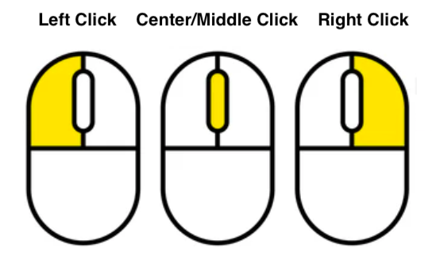
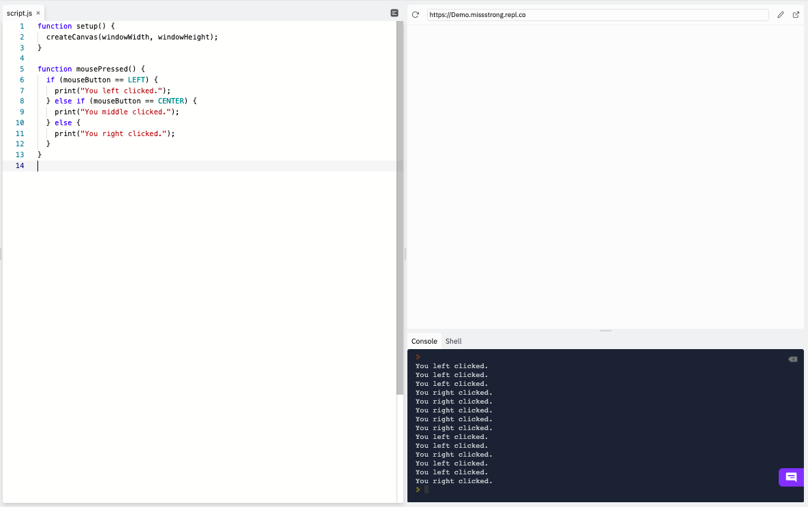
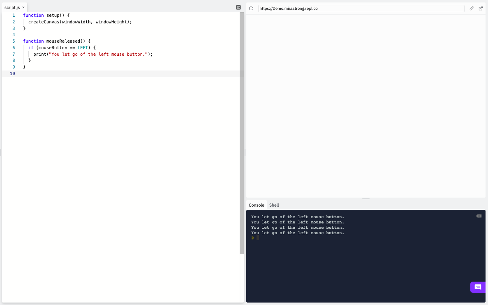

If we want to know which mouse button was pressed, we can use the string variable `mouseButton`. It stores the values of `LEFT` (equivalent to `"left"`), `CENTER` (equivalent to `"center"`), or `RIGHT` (equivalent to `"right"`), depending on which one was most recently pressed. On a trackpad, a left click is the same as a one-finger click, a right click is the same as a two-finger click, and a middle click is the same as a three-finger click. 



```js
function setup() {
  createCanvas(windowWidth, windowHeight);
}

function mousePressed() {
  if (mouseButton == LEFT) { 
    print("You left clicked.");
  } else if (mouseButton == CENTER) {
    print("You middle clicked.");
  } else {
    print("You right clicked.");
  }
}
```



If we want something to happen when a mouse button is released as opposed to when it's first pressed, we can use `mouseReleased()` instead. However, in Replit this only works for left and midde clicks, since right clicking on the canvas open a menu.

```js
function setup() {
  createCanvas(windowWidth, windowHeight);
}

function mouseReleased() {
  if (mouseButton == LEFT) { 
    print("You let go of the left mouse button.");
  }
}
```


