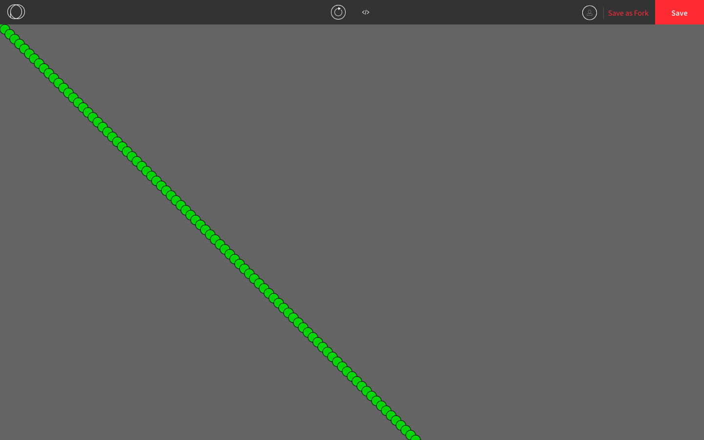

### Custom Objects

Custom objects are useful when we have many variables that are better off grouped together. For example, if we are creating a program that draws circles, we can make a circle object that has properties for its coordinates, size, colours, and any other information.

Here is a program we saw earlier.

```js
let coordinate = 0;

function setup() {
  createCanvas(windowWidth, windowHeight);
  background(100);
}
  
function draw() {
  ellipse(coordinate, coordinate, 20, 20); 
  coordinate += 10; 
}
```


The syntax for a custom object looks like this:

```js
let circle = { // "let" followed by the object name, an equal sign, and an opening brace
  coordinate: 0, // the list of properties, with the key and value separated by a colon
  diameter: 20 
} // a closing brace after all the properties are listed
```

Once we define `circle` like that, we use `circle.coordinate` and `circle.diameter` instead of `coordinate` and `diameter`.

Here's what the program looks like now. It does the same thing as before but now it's easier to read and debug if needed.

```js
let circle = { // circle is an object 
  coordinate: 0,
  diameter: 20
}

function setup() {
  createCanvas(windowWidth, windowHeight);
  background(100);
}
  
function draw() {
  ellipse(circle.coordinate, circle.coordinate, circle.diameter, circle.diameter); // dot syntax is used to get the values in the circle object
  circle.coordinate += 10; // increments work on object keys
}
```


We can add more fields if we want, such as the colours of the circle. Since each colour has three properties, we can make the colour an object with three fields. 

```js
let circle = {
  coordinate: 0,
  diameter: 20,
  colour: {
    r: 50,
    g: 205,
    b: 50
  }
}

function setup() {
  createCanvas(windowWidth, windowHeight);
  background(100);
  fill(circle.colour.r, circle.colour.g, circle.colour.b); // dot syntax looks like this when you have an object inside an object
}
  
function draw() {
  ellipse(circle.coordinate, circle.coordinate, circle.diameter, circle.diameter); 
  circle.coordinate += 10; 
}
```



### Using Arrays to Store Objects

If we wanted several shapes with different properties on our canvas, we can use an array to keep track of each individual one.

For example, this program shows 20 different circles "falling" down.

```js
let circles = []; // this will store all the circles
let numCircles = 20; // there will be 20 circles altogether

function setup() {
  createCanvas(500, 500);
  for (let index = 0; index < numCircles; index++) { // makes 20 random circles
    let circle = {
      x: random(501), // random x and y coordinates
      y: random(501),
      diameter: random([25, 50, 75]) // random diameter among these three numbers
    }
    circles.push(circle); // puts the circle into the array
  }
}

function draw() {
  for (let index = 0; index < numCircles; index++) { // goes through each of the 20 circles
  let circle = circles[index];
    ellipse(circle.x, circle.y, circle.diameter); 
    circle.y++; // increases the y coordinate so that it looks like the circle is falling
    if (circle.y > 500) { // when the circle falls off the screen, it goes back to the top
      circle.y = 0;
    }
  }
}
```


