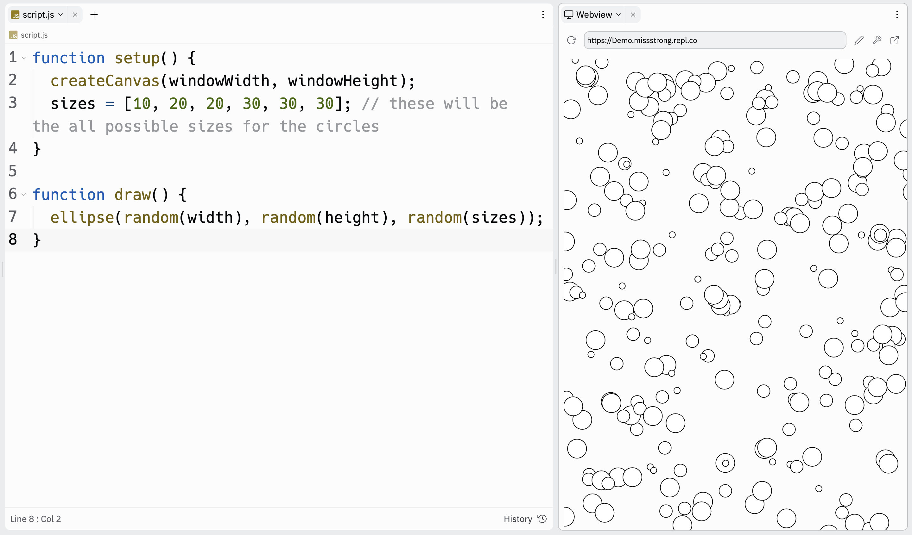

# [Link to video.](https://www.youtube.com/watch?v=KyVwTdMoOR8&list=PLVD25niNi0Bmz_QDPAm_KPNxGRWDfVZnO)

### Arrays

Suppose we want to generate a random multiple of 10 between 0 and 50.

One solution is to generate a random integer between 0 and 5, then multiply that result by 10:

```js
function setup() {
  print(10*int(random(0, 6))); // prints a random multiple of 10 between 0 and 50
}
```

Another solution is to use an **array**. An array is a data structure that stores a list of **items**. If we call `random()` and give it an **array** as a parameter, it will generate a random item from the array.

Arrays are enclosed in square brackets `[]` and their items are separated by commas.

```js
function setup() {
  let numbers = [0, 10, 20, 30, 40, 50]; // an array
  print(random(numbers)); // prints a random number from the array
}
```

If we use an array that has duplicates, we can change the probabilities of each outcome.

```js
function setup() {
  let numbers = [10, 20, 20, 30, 30, 30]; // an array with duplicate items
  print(random(numbers)); // 1/2 chance of 30, 1/3 chance of 20, 1/6 chance of 10
}
```

We can use this idea to make circles of various sizes.

```js
function setup() {
  createCanvas(windowWidth, windowHeight);
  sizes = [10, 20, 20, 30, 30, 30]; // these will be the all possible sizes for the circles
}

function draw() {
  ellipse(random(width), random(height), random(sizes));
}
```


