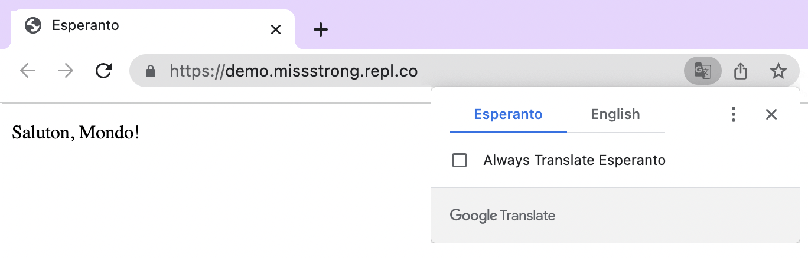
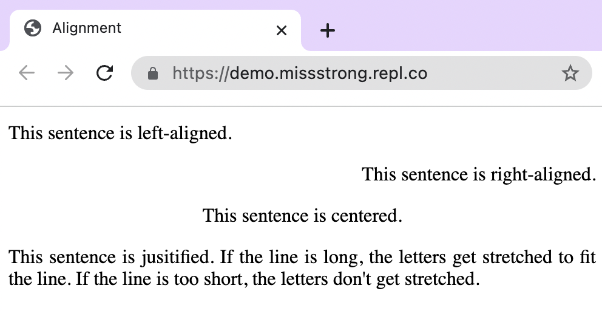

# [Link to video.](https://www.youtube.com/watch?v=8laE-v6aLGs&list=PLVD25niNi0BnHHieFb-9egE6e3kno8Su-)

### Attributes

An attribute is a parameter in a tag that causes the element to behave in specific way. 

Attributes are written inside the opening tag. They precede the tag name and are followed by a `=` and the value of the attribute.

### Language of a Website

The attribute `lang` within an `<html>` tag specifies the main language of the webpage. The value for English is `"en"`. We can find values of other languages by looking up the [ISO 639-1 Language Code](https://en.wikipedia.org/wiki/List_of_ISO_639-1_codes).

```html
<html lang="en">
```

If the language of the webpage doesn't match the language of your browser, you might get a pop-up from Google Translate offering to translate the page for you.



```html
<!DOCTYPE html>
<html lang="eo">
  <head>
    <title>Esperanto</title>
  </head>
  <body>
    <p>Saluton, Mondo!</p>
  </body>
</html>
```

### Aligning Text

The attribute `align` within a `<p>` tag indicates the alignment of the text in the paragraph. Some of the values we can use include `left` (left-aligned), `right` (right-aligned), `center` (centered), and `justify` (the letters are stretched to fit the page, like in a book or newspaper).

```html
<!DOCTYPE html>
<html lang="en">
  <head>
    <title>Alignment</title>
  </head>
  <body>
   <p align="left">This sentence is left-aligned.</p>
    <p align="right">This sentence is right-aligned.</p>
    <p align="center">This sentence is centered.</p>
    <p align="justify">This sentence is jusitified. If the line is long, the letters get stretched to fit the line. If the line is too short, the letters don't get stretched.</p>>
  </body>
</html>

 ```


