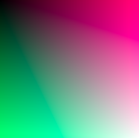
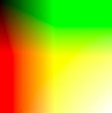
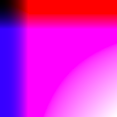
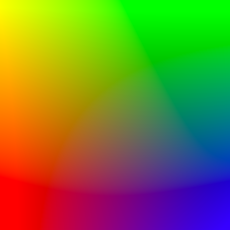
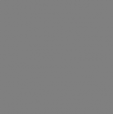

# [Link to video.](https://www.youtube.com/watch?v=iIoN_BCHAfM&list=PLVD25niNi0Bmz_QDPAm_KPNxGRWDfVZnO)

### Custom Images

Instead of importing images we find on the Internet or snap ourself, we can use `createImage()` to make our own image pixel-by-pixel. We still need to use `loadPixels()` before we set the pixel colours and `updatePixels()` afterwards.

Here are a few examples:

```javascript
function setup() {
  createCanvas(windowWidth, windowHeight);
  let img = createImage(256, 256); // this creates a 256 by 256 blank image 
  img.loadPixels();
  for (let x = 0; x < img.width; x++) {
    for (let y = 0; y < img.height; y++) {
      newColour = color(x, y, (x+y)/2);
      img.set(x, y, newColour);
    }
  }
  img.updatePixels();
  image(img, 0, 0);
}
```



```javascipt
function setup() {
  createCanvas(windowWidth, windowHeight);
  let img = createImage(256, 256); // this creates a 256 by 256 blank image 
  img.loadPixels();
  for (let x = 0; x < img.width; x++) {
    for (let y = 0; y < img.height; y++) {
      newColour = color(y*2, x*2, x*y/256);
      img.set(x, y, newColour);
    }
  }
  img.updatePixels();
  image(img, 0, 0);
}
```



```javascript
function setup() {
  createCanvas(windowWidth, windowHeight);
  let img = createImage(256, 256); // this creates a 256 by 256 blank image 
  img.loadPixels();
  for (let x = 0; x < img.width; x++) {
    for (let y = 0; y < img.height; y++) {
      newColour = color(x*x/16, x*y/256, y*y/16);
      img.set(x, y, newColour);
    }
  }
  img.updatePixels();
  image(img, 0, 0);
}
```



```javascript
function setup() {
  createCanvas(windowWidth, windowHeight);
  let img = createImage(256, 256); // this creates a 256 by 256 blank image 
  img.loadPixels();
  for (let x = 0; x < img.width; x++) {
    for (let y = 0; y < img.height; y++) {
      newColour = color(255-x, 255-y, x*y/256);
      img.set(x, y, newColour);
    }
  }
  img.updatePixels();
  image(img, 0, 0);
}
```



```javascript
function setup() {
  createCanvas(windowWidth, windowHeight);
  let img = createImage(256, 256); // this creates a 256 by 256 blank image 
  img.loadPixels();
  for (let x = 0; x < img.width; x++) {
    for (let y = 0; y < img.height; y++) {
      newColour = color(((x+y) % 2) * 255);
      img.set(x, y, newColour);
    }
  }
  img.updatePixels();
  image(img, 0, 0);
}
```


