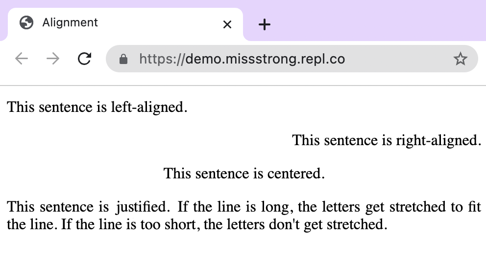

# Link to video.

### Attributes

An attribute is a parameter in a tag that causes the element to behave in specific way. 

Attributes are written inside the opening tag. They precede the tag name and are followed by a `=` and the value of the attribute.

### Language of a Website

The attribute `lang` within an `<html>` tag specifies the main language of the webpage. The value for English is `'en'`. We can find values of other languages by looking up the [ISO 639-1 Language Code](https://en.wikipedia.org/wiki/List_of_ISO_639-1_codes).

```html
<html lang='en'>
```

If the language of the webpage doesn't match the language of your browser, you might get a pop-up from Google Translate offering to translate the page for you.


```html
<!DOCTYPE html>
<html lang='eo'>
    <head>
        <title>Esperanto</title>
    </head>
    <body>
        <p>Saluton, Mondo!</p>
    </body>
</html>
```

### Aligning Text

The attribute `align` within a `<p>` tag indicates the alignment of the text in the paragraph. Some of the values we can use include `left` (left-aligned), `right` (right-aligned), `center` (centered), and `justify` (the letters are stretched to fit the page, like in a book or newspaper).

```html
<!DOCTYPE html>
<html lang='en'>
    <head>
        <title>Alignment</title>
    </head>
    <body>
        <p align='left'>This sentence is left-aligned.</p>
        <p align='right'>This sentence is right-aligned.</p>
        <p align='center'>This sentence is centered.</p>
        <p align='justify'>This sentence is justified. If the line is long, the letters get stretched to fit the line. If the line is too short, the letters don't get stretched.</p>
    </body>
</html>

 ```


