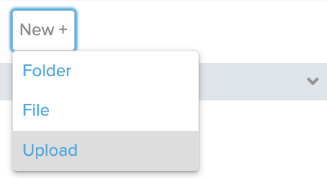

# [Link to video.](https://www.youtube.com/watch?v=gNNj_6eGf9k&list=PLVD25niNi0Bk1YWMw3RRMgqYjCRoZYisT)

### Images

To display an image, we use the self-closing `` tag. The location of the image is called an **image source**. The attribute for an image source is `src`. 

If the image file is in the same folder as the HTML file, the file source is just the name of the file. 

```html
<!DOCTYPE html>
<html lang='en'>
    <head>
        <title>Image</title>
    </head>
    <body>
        
    </body>
</html>
```



Here's what the webpage looks like:


It's common practice to include an `alt` tag, which indicates the text that appears when we hover over the image. We can also modify the width and height of an image using the `width` and `height` attributes.

```html
<!DOCTYPE html>
<html lang='en'>
    <head>
        <title>Image</title>
    </head>
    <body>
        
    </body>
</html>
```


If the image is in a folder then we need to specify the filepath. We write the folder name followed by a forward slash followed by the filename.

```html
<!DOCTYPE html>
<html lang='en'>
    <head>
        <title>Image</title>
    </head>
    <body>
        
    </body>
</html>
```


