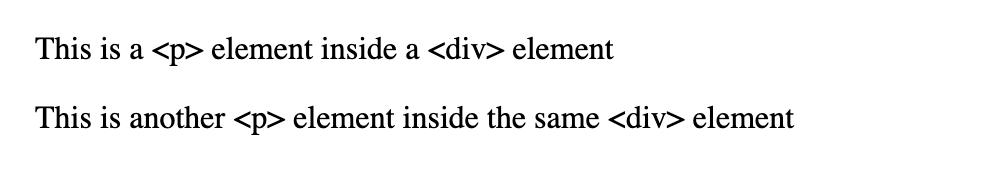
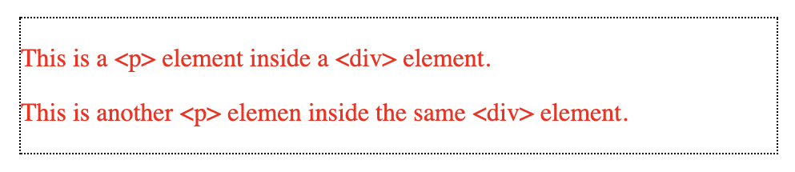
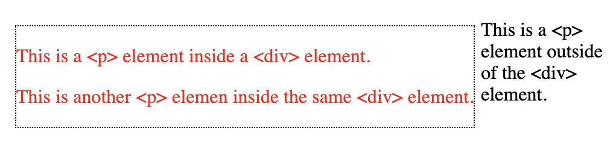

# Link to video.

### Sections

We can use the `<div>` (division) tag to separate a webpage into sections. This allows us to group elements together and style them accordingly.

Here is an example:



```html
<!DOCTYPE html>
<html lang='en'>
    <head>
        <title>Sections</title>
        <link href='style.css' rel='stylesheet' type='text/css' />
    </head>
    <body>
        <div id='section1'>
            <p>This is a &lt;p&gt; element inside a &lt;div&gt; element</p>
            <p>This is another &lt;p&gt; element inside the same &lt;div&gt; element</p>
        </div>
    </body>
</html>
```

The `&lt;` (the less than symbol) and `&gt;` (the greater than symbol) are used instead of `<` and `>` since otherwise they would be interpretted as tags.

```css
#section1 {
    border-color: black;  /* the border will be black */
    border-style: dotted; /* the border will be dotted */
    border-width: 2px; /* the border will have a thickness of 2 pixels */
    color: red; /* the text will be red */
    margin: 5px; /* there will be 5px of space outside the all sides of the border of the section */
}
```

Here is [the full list of values for `border-style`](https://developer.mozilla.org/en-US/docs/Web/CSS/border-style#values).

By default, `<div>` elements take up the entire width of the webpage. If we want it to take up only as much width as it needs, we can add `float: left;` to the CSS.



```css
#section1 {
    border-color: black;  
    border-style: dotted;
    border-width: 2px; 
    color: red;
    margin: 5px; 
    float: left; /* the section's width will be minimal and not stretch the entire width of the webpage */
}
```

Putting `float: left;` also allows us to put something directly to the right of a section if there's space for it. Otherwise, it would appear underneath it.


