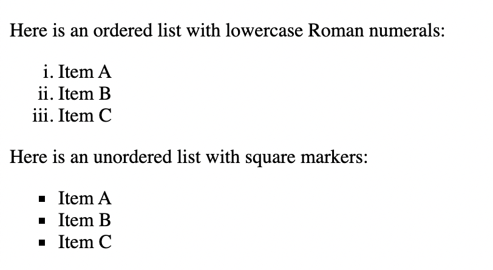
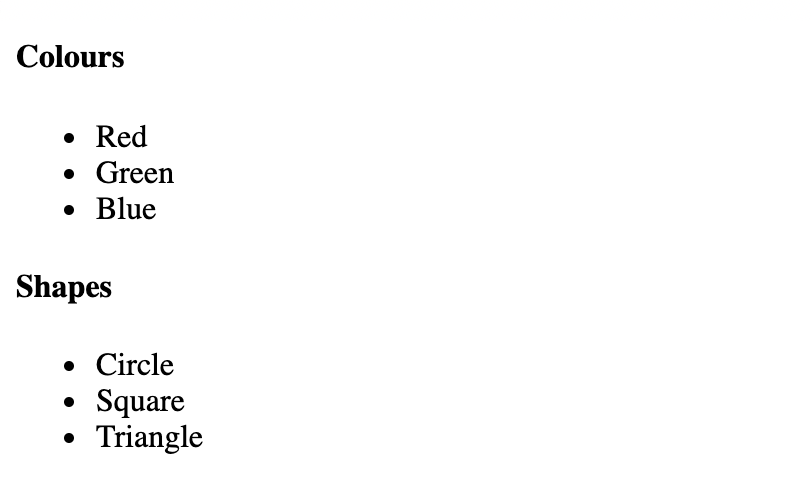
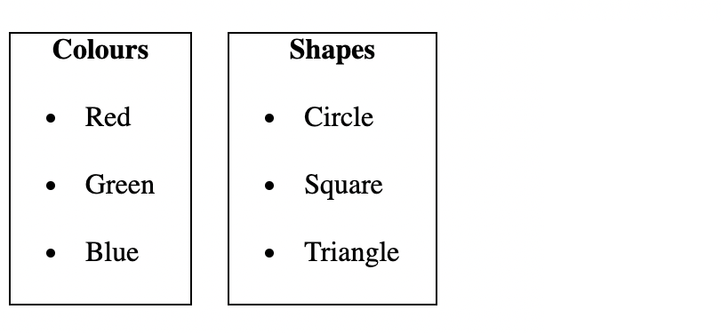

# [Link to video.](https://www.youtube.com/watch?v=-HoIQkTk6Yc&list=PLVD25niNi0Bk1YWMw3RRMgqYjCRoZYisT)

### Lists

**Ordered lists** are lists with numbered items whereas **unordered lists** are lists with bulleted items. We can create an ordered list with the `<ol>` tag and an unordered list with the `<ul>` tag. The items within either type of list use `<li>` (list item) tags.


```html
<!DOCTYPE html>
<html lang='en'>
    <head>
        <link href='style.css' rel='stylesheet' type='text/css' />
        <title>Lists</title>
    </head>
    <body>
        <p>Here is an ordered list:</p>
        <ol>
            <li>Item A</li>
            <li>Item B</li>
            <li>Item C</li>
        </ol>
        <p>Here is an unordered list:</p>
        <ul>
            <li>Item A</li>
            <li>Item B</li>
            <li>Item C</li>
        </ul>
    </body>
</html>
```

The symbols in front of each item is called a **list marker**. By default, the list markers for unordered lists are closed circles • and the list markers for ordered lists are Hindu-Arabic numerals (0, 1, 2, ..., 9).

We can change the list marker using the `list-style-type` property on `ul` or `ol`. 



```html
<!DOCTYPE html>
<html lang='en'>
    <head>
        <link href='style.css' rel='stylesheet' type='text/css' />
        <title>Lists</title>
    </head>
    <body>
        <p>Here is an ordered list with lowercase Roman numerals:</p>
        <ol>
            <li>Item A</li>
            <li>Item B</li>
            <li>Item C</li>
        </ol>
        <p>Here is an unordered list with square markers:</p>
        <ul>
            <li>Item A</li>
            <li>Item B</li>
            <li>Item C</li>
        </ul>
    </body>
</html>
```

```css
ol {
    list-style-type: lower-roman; /* Makes the list marker for ordered lists lowercase Roman numerals */
}

ul {
    list-style-type: square;  /* Makes the list marker for unordered lists closed squares */
}
```

Here is the [full list of values for `list-style-type`](https://developer.mozilla.org/en-US/docs/Web/CSS/list-style-type#values).

We can place lists inside of sectioned elements such as `<div>` or `<table>`.



```html
<!DOCTYPE html>
<html lang='en'>
    <head>
        <link href='style.css' rel='stylesheet' type='text/css' />
        <title>Lists</title>
    </head>
    <body>
        <div>
            <h4>Colours</h4>
            <ul id='colours'>
                <li>Red</li>
                <li>Green</li>
                <li>Blue</li>
            </ul>
        </div>
        <div>
            <h4>Shapes</h4>
            <ul id='shapes'>
                <li>Circle</li>
                <li>Square</li>
                <li>Triangle</li>
            </ul>
        </div>
    </body>
</html>
```

Let's add some styling to the webpage above.




```css
h4 {
    margin-top: 0px; /* Puts the text to the very top of the section */
    text-align: center; /* Centers the text */
}

div {
    float: left; /* Makes the div elements go next to each other */
    border: 1px solid black; /* The border around the div */
    margin: 10px; /* Puts a space of 10 pixels around each section */
    vertical-align: top; /* Aligns the text to the top of the section */
}

ol, ul {
    padding-left: 0px; /* Removes the space to the left of each marker */
    list-style-position: inside; /* Attaches the marker to the text in the list item */
}

li {
    margin: 20px; /* Puts a space of 20 pixels around each list item */
}
```
