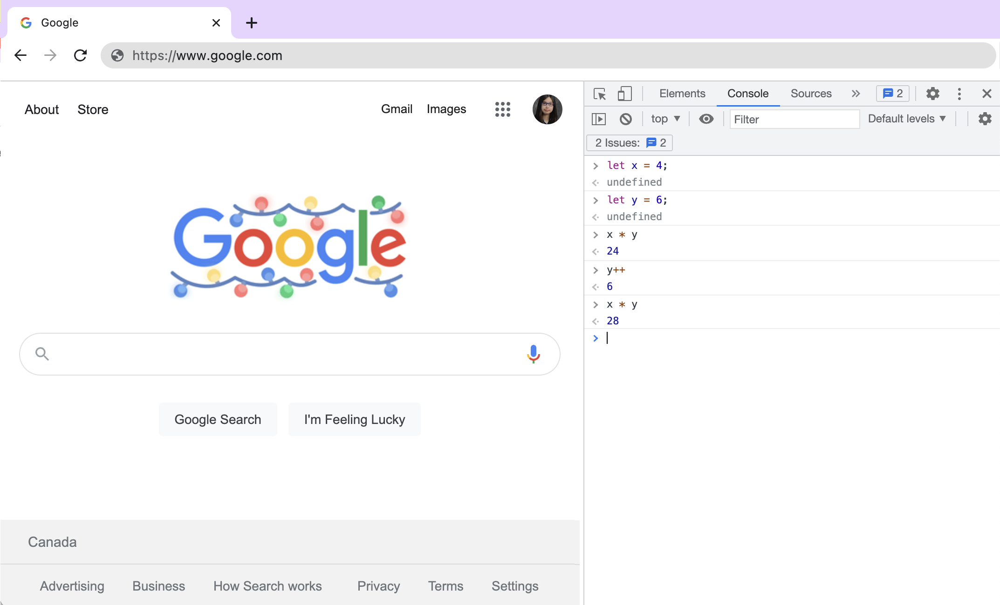

# Link to video.

### Running JavaScript Programs

We've been using P5.js, a JavaScript framework. All of our P5.js programs had the code below in the `index.html` file.

```html
<!DOCTYPE html>
<html>
    <head>
        <meta charset='utf-8'>
        <meta name='viewport' content='width=device-width'>
        <title>repl.it</title>
        <link href='style.css' rel='stylesheet' type='text/css' />
        <script src='https://cdn.jsdelivr.net/npm/p5@1.3.1/lib/p5.js'></script>
    </head>
    <body>
        <script src='script.js'></script>
    </body>
</html>
```

In an HTML file, `<script>` tags are used to run JavaScript programs. If we put a `src` attribute with a path to a JavaScript program, it runs that program. 

The line `<script src='https://cdn.jsdelivr.net/npm/p5@1.3.1/lib/p5.js'></script>` is what loads all the code behind P5.js. The line `<script src='script.js'></script>` runs the program that we made.


### JavaScript Basics

We've already seen plenty of JavaScript keywords, operators, and data types when we were learning P5.js. Here's a summary of what we've seen so far.

Keywords:
* `function`
* `let`
* `var`
* `const`
* `if`
* `while`
* `for`

Operators:
* `{`, `}`
* `(`, `)`
* `!`
* `+`, `-`, `*`, `/`
* `<`, `>`, `<=`, `>=`
* `==`, `!=`, `===`, `!==`
* `&&`
* `||`
* `=`

Data Types:
* numbers
* booleans: `true`, `false`
* strings: `'hello'`
* arrays: `[1, 2, 3]`
* objects

One new thing is that `print()` doesn't print text to the console – it opens your printer settings! If we want to print text to the console, we use `console.log()` instead.

### Browser Consoles

Every browser has a built-in console that we can use to write JavaScript code. To access it, right click on a webpage and go to 'Inspect' (depending on the browser it might be 'Inspect Element' or something similar). You should be under tab called *Elements* which shows you the HTML and CSS for the webpage you're on. In the navigation you should see the tab *Console* for the console and the tab *Sources* for the file tree for the webpage you're on. We can play with the console here just like we can in Replit.


