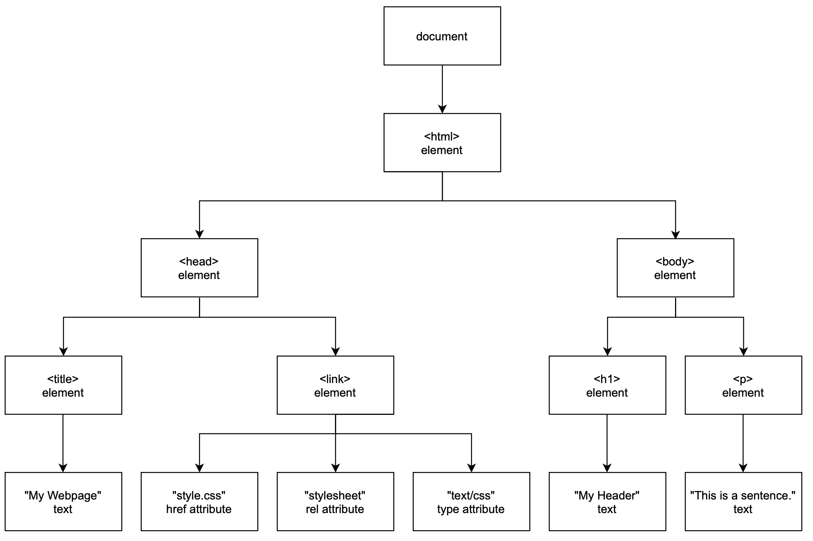

# Link to video.

### Document Object Model

A **Document Object Model** (DOM) of a webpage is a model showing how all the HTML elements are connected. At the top is the **document**, which represents the entire webpage. Below the document we have the `<html>` element, and below that we have `<head>` element and `<body>` element. Below those we have all the other elements and their attributes and text.

Here is an example of an html file and its DOM.

```html
<!DOCTYPE html>
<html lang='en'>
    <head>
        <title>My Webpage</title>
        <link href='style.css' rel='stylesheet' type='text/css' />
    </head>
    <body>
        <h1>My Header</h1>
        <p>This is a sentence.</p>
    </body>
</html>
```



A model is automatically created by the browser when we load a webpage. This is what allows us to use JavaScript to modify the HTML elements and the CSS styles.

To access a specific element, we can make an `id` attribute for it and use the `document` method `.getElementById()`. This will return the element as an object. We can change the text inside a set of opening and closing tags by modifying the `innerText` property of the element object. It's important that we run the JavaScript code after the HTML elements have been created.

```html
<!DOCTYPE html>
<html lang='en'>
    <head>
        <title>My Webpage</title>
        <link href='style.css' rel='stylesheet' type='text/css' />
    </head>
    <body>
        <h1>My Header</h1>
        <p id='sentence'>This is a sentence.</p>
        <script src='script.js'></script>
    </body>
</html>
```

```js
// This is script.js

document.getElementById('sentence').innerText = 'This is a different sentence.'; // changes the text in the <p> tag
```

If we want the text to contain HTML tags, we can change the `innerHTML` property instead.


```js
// This is script.js

document.getElementById('sentence').innerHTML = 'This is a <em>different</em> sentence.'; // changes the HTML code in the <p> tag
```

To change the styling of an element, we can modify its `style` property.

```js
// This is script.js

document.getElementById('sentence').style = 'color: red'; // changes the styling of the text in the <p> tag
```

Here's another way to change the `style` property:

```js
// This is script.js

document.getElementById('sentence').style.color = 'red'; // changes the styling of the text in the <p> tag
```
