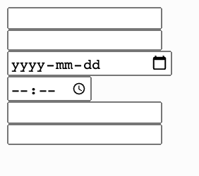
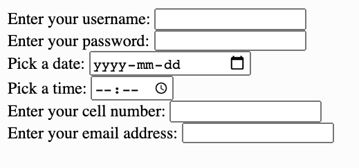

# Link to video.

### User Input

We can create input fields for users to enter information into. We start by using `<form>` tags to indicate a section of input fields and inside it we use   `<input>` (self-closing) tags for each input field. The `<input>` tag has an attribute called `type` which indicates what type of input field it is.

```html
<!DOCTYPE html>
<html lang='en'>
    <head>
        <title>User Input</title>
    </head>
    <body>
        <form>
            <input type='text' />
            <br />
            <input type='password' />
            <br />
            <input type='date' />
            <br />
            <input type='time' />
            <br />
            <input type='tel' />
            <br />
            <input type='email' />
            <br />
        </form>
    </body>
</html>
```



We can add labels to each input field to make it clear what each one is for. The `<label>` tag has an attribute `for` which is used to show which element it labels based on its `id`. The `for` attribute allows the user to click on the label to get the cursor into the field and allows to screen readers to read the page aloud more accurately.

```html
<!DOCTYPE html>
<html lang='en'>
    <head>
        <title>User Input</title>
    </head>
    <body>
        <form>
            <label for='user-name'>Enter your username:</label>
            <input type='text' id='user-name' />
            <br />
            <label for='user-password'>Enter your password:</label>
            <input type='password' id='user-password' />
            <br />
            <label for='user-date' >Pick a date:</label>
            <input type='date' id='user-date' />
            <br />
            <label for='user-time'>Pick a time:</label>
            <input type='time' id='user=time' />
            <br />
            <label for='user-cell'>Enter your cell number:</label>
            <input type='tel' id='user-cell' />
            <br />
            <label for='user-email'>Enter your email address:</label>
            <input type='email' id='user-email' />
            <br />
        </form>
    </body>
</html>
```



Another `type` of `<input>` is `'button'`, which we can put so that the user can indicate that they're done entering the information. This tag has an attribute `value` for the text to display on the button and an attribute `onclick` for the code to run when the user clicks the button.

We'll also want to add the attribute `onsubmit='return false;'` to the `form` tag to prevent the page from sending the information to a server (which reloads the page in Replit).

```html
<!DOCTYPE html>
<html lang='en'>
    <head>
        <title>User Input</title>
    </head>
    <body>
        <form onsubmit='return false;'>
            <label for='user-name'>Enter your username:</label>
            <input type='text' id='user-name' />
            <br />
            <label for='user-password'>Enter your password:</label>
            <input type='password' id='user-password' />
            <br />
            <label for='user-date' >Pick a date:</label>
            <input type='date' id='user-date' />
            <br />
            <label for='user-time'>Pick a time:</label>
            <input type='time' id='user-time' />
            <br />
            <label for='user-cell'>Enter your cell number:</label>
            <input type='tel' id='user-cell' />
            <br />
            <label for='user-email'>Enter your email address:</label>
            <input type='email' id='user-email' />
            <br />
            <input type='button' value='Done' onclick='console.log("Thanks!");'>
        </form>
    </body>
</html>
```


Notice how there are two types of quotation marks in `onclick='console.log("Thanks!");'`. This is because if you use the same type together, the program will give you an error due to it thinking it's two separate strings instead of one.

If we want to access the information from the fields that were entered, we can use the `value` field on the element object.

```html
<!DOCTYPE html>
<html lang='en'>
    <head>
        <title>User Input</title>
        <script src='script.js'></script>
    </head>
    <body>
        <form onsubmit='return false;'>
            <label for='user-name'>Enter your username:</label>
            <input type='text' id='user-name' />
            <br />
            <label for='user-password'>Enter your password:</label>
            <input type='password' id='user-password' />
            <br />
            <label for='user-date' >Pick a date:</label>
            <input type='date' id='user-date' />
            <br />
            <label for='user-time'>Pick a time:</label>
            <input type='time' id='user-time' />
            <br />
            <label for='user-cell'>Enter your cell number:</label>
            <input type='tel' id='user-cell' />
            <br />
            <label for='user-email'>Enter your email address:</label>
            <input type='email' id='user-email' />
            <br />
            <input type='button' value='Done' onclick='recap();'>
        </form>
    </body>
</html>
```

```js
// This is in the script.js file

function recap() {
    let name = document.getElementById('user-name').value;
    let time = document.getElementById('user-time').value;
    let cell = document.getElementById('user-cell').value;
    let email = document.getElementById('user-email').value;
    console.log('Name: ' + name);
    console.log('Time: ' + time);
    console.log('Cell: ' + cell);
    console.log('Email: ' + email);
}
```


