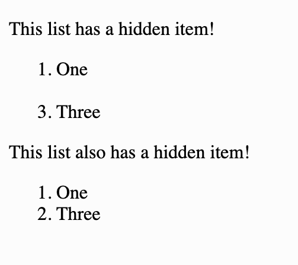

# Link to video.

### Hiding Elements

There is more than one way to hide elements. One way is to set the `visibility` property to `hidden` in the CSS file.

```html
<!DOCTYPE html>
<html lang="en">
  <head>
    <title>Hiding Elements</title>
    <link href="style.css" rel="stylesheet" type="text/css" />
  </head>
  <body>
    <p id="sentence">This sentence is invisible!</p>
  </body>
</html>
```

```css
#sentence {
  visibility: hidden;
}
```

We can also put the styling in the HTML tag directly.

```html
<!DOCTYPE html>
<html lang="en">
  <head>
    <title>Hiding Elements</title>
  </head>
  <body>
    <p id="sentence" style="visibility:hidden;">This sentence is invisible!</p>
  </body>
</html>
```

We can also modify the styling using JavaScript.

```html
<!DOCTYPE html>
<html lang="en">
  <head>
    <title>Hiding Elements</title>
  </head>
  <body>
    <p id="sentence">This sentence will be invisible when the JavaScript runs!</p>    
    <script src="script.js"></script>
  </body>
</html>
```

```js
// This is in the script.js file

let sentence = document.getElementById("sentence");
sentence.style.visibility = "hidden";
```

If we want to unhide a hidden element, we set the visibility to `visible` instead of `hidden`.

```html
<!DOCTYPE html>
<html lang="en">
  <head>
    <title>Hiding Elements</title>
  </head>
  <body>
    <p id="sentence" style="visibility:hidden;">This sentence will be visible when the JavaScript runs!</p>
    <script src="script.js"></script>
  </body>
</html>
```

```js
// This is in the script.js file

let sentence = document.getElementById("sentence");
sentence.style.visibility = "visible"; // changes the element from hidden to visible
```

Another way of hiding an element is to set the `display` property to `none` in the CSS.

```html
<!DOCTYPE html>
<html lang="en">
  <head>
    <title>Hiding Elements</title>
    <link href="style.css" rel="stylesheet" type="text/css" />
  </head>
  <body>
    <p id="sentence">This sentence is invisible!</p>
  </body>
</html>
```

```css
#sentence {
  display: none;
}
```

If we want to change the display to make it visible again, we set it to `block` or `inline` instead of `none`. The difference between `block` and `inline` is that block elements begin on a new line whereas inline elements do not.

```html
<!DOCTYPE html>
<html lang="en">
  <head>
    <title>Hiding Elements</title>
  </head>
  <body>
    <p id="sentence" style="display:none;">This sentence will be visible when the JavaScript runs!</p>
    <script src="script.js"></script>
  </body>
</html>
```

```js
// This is in the script.js file

let sentence = document.getElementById("sentence");
sentence.style.display = "inline"; // changes the element from hidden to visible
```

The difference between using `visibility: hidden` and `display: none` is that when we change the `visibility` the element still takes up space whereas if we change the `display` it makes it seem like the element is not there at all.

```html
<!DOCTYPE html>
<html lang="en">
  <head>
    <title>Hiding Elements</title>
  </head>
  <body>
    <p>This list has a hidden item!</p>
    <ol>
      <li>One</li>
      <li style="visibility:hidden;">Two</li>
      <li>Three</li>
    </ol>
    <p>This list also has a hidden item!</p>
    <ol>
      <li>One</li>
      <li style="display:none;">Two</li>
      <li>Three</li>
    </ol>
  </body>
</html>
```


