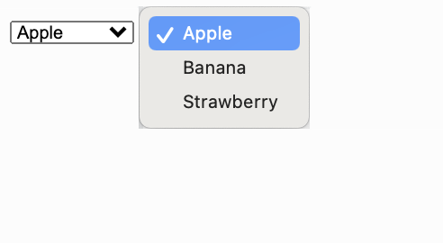

# Link to video.

### Dropdown Menus

We can create dropdown menus for users to choose an option. We start by using `<form>` tags, inside it we use `<select>` tags, then we use `<option>` tags for each option in the dropdown menu.

```html
<!DOCTYPE html>
<html>
    <head>
        <title>Dropdown Menu</title>
    </head>
    <body>
        <form>
            <select>
                <option>Apple</option>
                <option>Banana</option>
                <option>Strawberry</option>
            </select>
        </form>
    </body>
</html>
```



If we want something to happen when we select an option, we can use the `onchange` attribute in `<select>`. This allows us to call a function whenever an option is selected.

To determine which option was selected, we can access the `selectedIndex` property on a `<select>` object.

```html
<!DOCTYPE html>
<html>
    <head>
        <title>Dropdown Menu</title>
        <link href='style.css' rel='stylesheet' type='text/css' />
        <script src='script.js'></script>
    </head>
    <body>
        <form>
            <label for='fruit-menu'>Pick a fruit:</label>
            <select id='fruit-menu' onchange='sayOption();'>
                <option>Apple</option>
                <option>Banana</option>
                <option>Strawberry</option>
            </select>
        </form>
    </body>
</html>
```


```js
// This is in the script.js file

function sayOption() {
    let fruitMenu = document.getElementById('fruit-menu');
    let index = fruitMenu.selectedIndex + 1;
    console.log('You chose option #' + index);
}
```


If we want to see the name of the option that was selected, we can add a `value` attribute to each `<option>` and access the `value` property of the `<option>` object. 

A `<select>` object is similar to an array. We can access the selected `<option>` object using the index.

```html
<!DOCTYPE html>
<html>
    <head>
        <title>Dropdown Menu</title>
        <link href='style.css' rel='stylesheet' type='text/css' />
        <script src='script.js'></script>
    </head>
    <body>
        <form>
            <label for='fruit-menu'>Pick a fruit:</label>
            <select id='fruit-menu' onchange='sayFruit();'>
                <option value='apple'>Apple</option>
                <option value='banana'>Banana</option>
                <option value='strawberry'>Strawberry</option>
            </select>
        </form>
    </body>
</html>
```

```js
// This is in the script.js file

function sayFruit() {
    let fruitMenu = document.getElementById('fruit-menu');
    let index = fruitMenu.selectedIndex;
    let fruit = fruitMenu[index].value;
    console.log('You chose ' + fruit);
}
```


