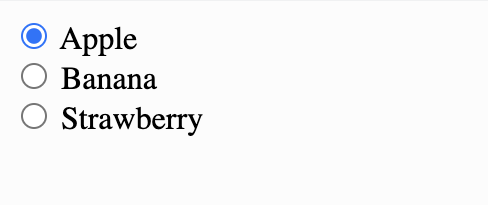

# [Link to video.](https://www.youtube.com/watch?v=ri-Cj4QpzDs&list=PLVD25niNi0Bk1YWMw3RRMgqYjCRoZYisT)

### Radio Button

A **radio button** is a group of boxes in which only one box is supposed be checked at a time.  We can create radio buttons using an `<input>` tag with `type='radio'`. To group radio buttons together, pick a name for the group and use the `name` attribute in each button.

```html
<!DOCTYPE html>
<html lang='en'>
    <head>
        <title>Radio Buttons</title>
    </head>
    <body>
        <form>
            <input type='radio' id='apple' name='fruit' />
             <label for='apple'>Apple</label>
             <br />
             <input type='radio' id='banana' name='fruit' />
             <label for='banana'>Banana</label>
             <br />
             <input type='radio' id='strawberry' name='fruit' />
             <label for='strawberry'>Strawberry</label>
        </form>
    </body>
</html>
```



We can choose which one is already selected at the start by adding the attribute `checked='true'`.

```html
 <input type='radio' id='apple' name='fruit' checked='true' />
```

If we want to make something happen when we select a radio button, we can use the `onclick` attribute on each button. This allows us to call a function whenever the checkbox is checked or unchecked.

We can get an array of all the radio button objects using `document.getElementsByName()` and we can find out which one is selected based on whether the `checked` property of each button is `true` or `false`.

```html
<!DOCTYPE html>
<html lang='en'>
    <head>
        <title>Radio Buttons</title>
        <script src='script.js'></script>
    </head>
    <body>
        <form>
            <input type='radio' id='apple' name='fruits' checked='true' onclick='sayFruit()' />
            <label for='apple'>Apple</label>
            <br />
            <input type='radio' id='banana' name='fruits' onclick='sayFruit()'/>
            <label for='banana'>Banana</label>
            <br />
            <input type='radio' id='strawberry' name='fruits' onclick='sayFruit()'/>
            <label for='strawberry'>Strawberry</label>
        </form>
    </body>
</html>
```

We can use a `for`-`of` loop to go through each button in the array of buttons. We'll take a closer look at `for`-`of` loops later in the course.

```js
// This is in the script.js file

function sayFruit() {
    let fruitButtons = document.getElementsByName('fruit');
    for (let fruitButton of fruitButtons) {
        if (fruitButton.checked) {
            let fruit = fruitButton.id;
            console.log("You chose " + chosenFruit);
        }
    }
}
```


