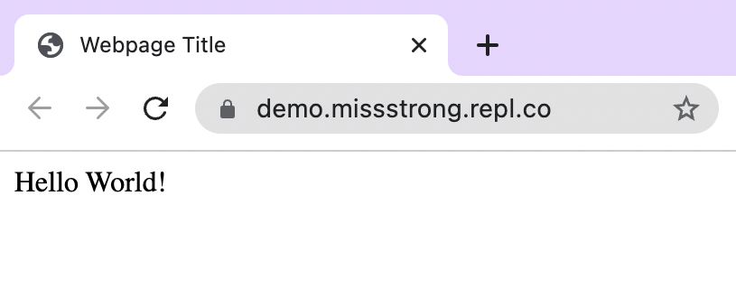

### What is HTML?

**Hypertext Markup Language** (HTML) is a language used to display **hypertext** on a webpage. Hypertext is text that can include links to other sites. All webpages on the Internet are stored and sent as HTML files.

There are several versions of HTML. The current one is called HTML5.

### Required HTML Tags

HTML code consists of **tags**. Tags use angular brackets `<>`. There are two types of tags: **opening tags** and **closing tags**. Closing tags contain a forward slash `/` whereas opening tags do not. Information typically goes between an opening tag and closing tag. All HTML5 files require the following tags:

* `<!DOCTYPE html>` tells the browser that we're using HTML5. The exclamation point indicates that this tag is a **declaration** (it declares information to the browser). The convention is to write declaration using all upper case letters.
* `<html>` and `</html>` indicate the part of the file that contains HTML code. The declaration is not a part of the HTML, but everything else should be inside these tags.
* `<head>` and `</head>` indicate the part of the file that contains information about the webpage. This includes the title
* `<title>` and `</title>` indicate the title of the webpage. This title appears on the tab in your browser.
* `<body>` and `</body>` indicate the part of the file that contains the content of the webpage. Most of your code would be inside here when there is a lot of information on the webpage.

Here's what it looks like all together. Whenever we have a tag inside a tag, the inner tag begins with an additional indent. Depending on how much information is between an opening tag and its corresponding closing tag, the opening and closing tags could be on the same line or on separates lines.

```html
<!DOCTYPE html>
<html>
  <head>
    <title>Webpage Title</title>
  </head>
  <body>
    Hello World!
  </body>
</html>
```

Here's what this webpage looks like:


