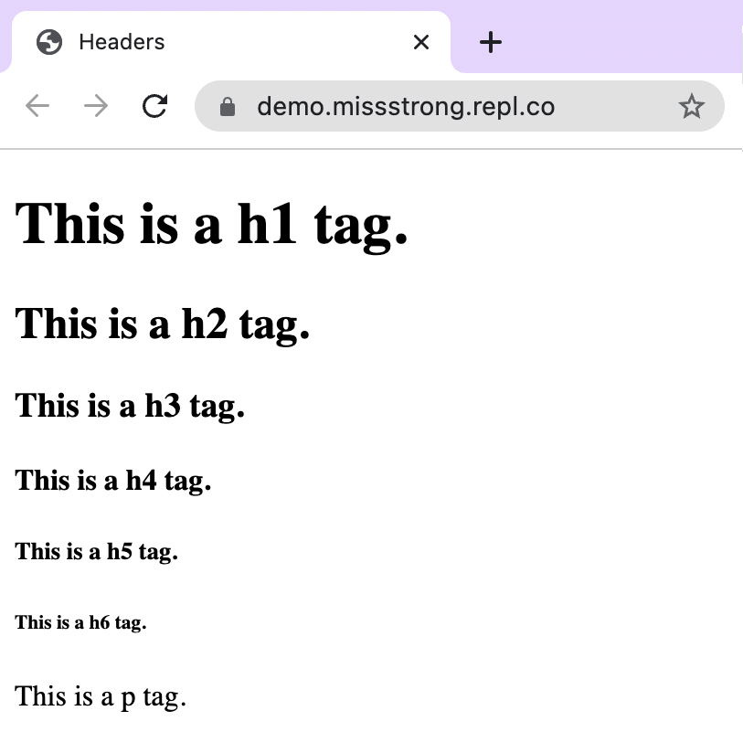
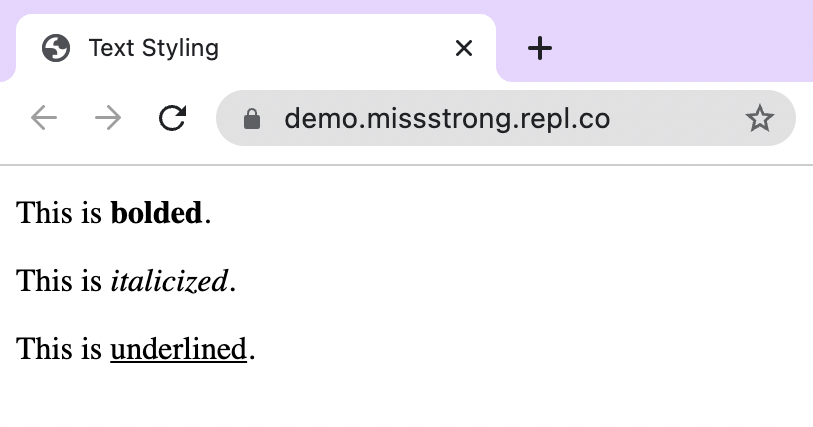

### HTML Text Tags

So far we've seen the following tags:
* `<!DOCTYPE html>`
* `<html>` and `</html>`
* `<head>` and `</head>` 
* `<title>` and `</title>`
* `<body>` and `</body>`

In the example shown earlier, we had the text `"Hello World"` inside the `<body>` tags. Although this is valid, text is usually written inside `<p>` tags, where *p* stands for **paragraph**.


```html
<!DOCTYPE html>
<html>
  <head>
    <title>Webpage Title</title>
  </head>
  <body>
    <p>Hello World!</p>
  </body>
</html>
```

If we want to put headers on our webpage, we can use the **header** tags: `<h1>`, `<h2>`, `<h3>`, all the way up to `<h6>`. The largest is h1 and the smallest one is h6.
  
```html
<!DOCTYPE html>
<html>
  <head>
    <title>Headers</title>
  </head>
  <body>
    <h1>This is a h1 tag.</h1>
    <h2>This is a h2 tag.</h2>
    <h3>This is a h3 tag.</h3>
    <h4>This is a h4 tag.</h4>
    <h5>This is a h5 tag.</h5>
    <h6>This is a h6 tag.</h6>
    <p>This is a p tag.</p>
  </body>
</html>
```



We can style text in `<p>` tags using these tags:
* `<b>` or `<strong>` for bold
* `<i>` or `<em>` (emphasis) for italics
* `<u>` for underline
  
```html
<!DOCTYPE html>
<html>
  <head>
    <title>Text Styling</title>
  </head>
  <body>
    <p>This is <b>bolded</b>.</p>
    <p>This is <i>italicized</i>.</p>
    <p>This is <u>underlined</u>.</p>
  </body>
</html>
```


