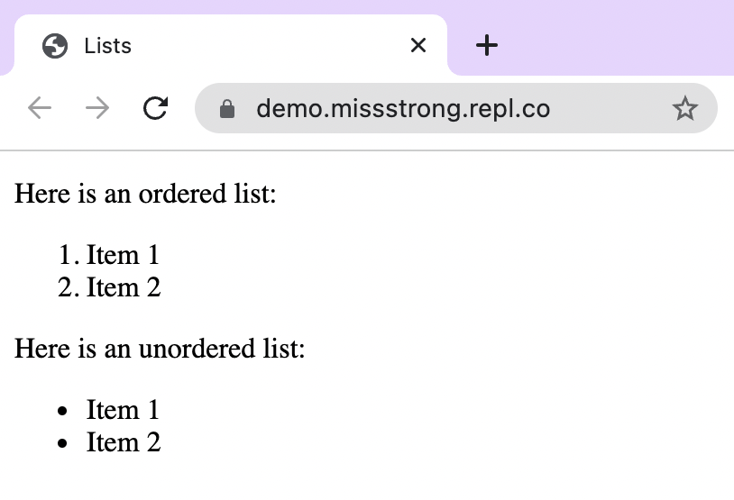
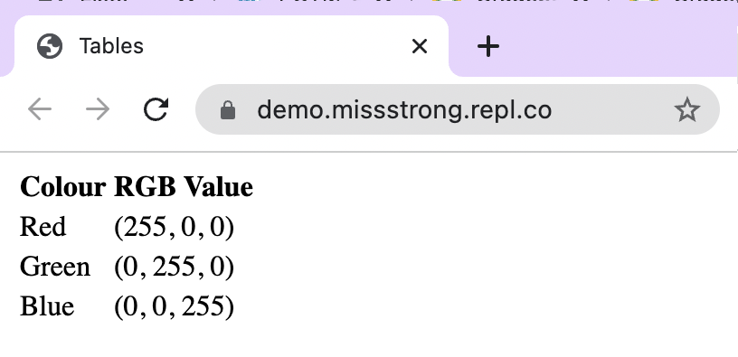

### Lists

**Ordered lists** are lists with numbered items whereas **unordered lists** are lists with bulleted items. We can create an ordered list with the `<ol>` tag and an unordered list with the `<ul>` tag. The items within either type of list use `<li>` tags.

```html
<!DOCTYPE html>
<html>
  <head>
    <title>Lists</title>
  </head>
  <body>
    <p>Here is an ordered list:</p>
    <ol>
      <li>Item 1</li>
      <li>Item 2</li>
    </ol>
    <p>Here is an unordered list:</p>
    <ul>
      <li>Item 1</li>
      <li>Item 2</li>
    </ul>
  </body>
</html>
```



### Tables

Tables use `<table>` tags. Every row in the table uses `<tr>` (table row) tags. Each cell in the first row should use `<th>` (table header) tags if the first row is a header and all the cells should use `<td>` (table data) tags.

```html
<!DOCTYPE html>
<html>
  <head>
    <title>Tables</title>
  </head>
  <body>
    <table>
      <tr>
        <th>Colour</th>
        <th>RGB Value</th> 
      </tr>
      <tr>
        <td>Red</td>
        <td>(255, 0, 0)</td>
      </tr>
      <tr>
        <td>Green</td> 
        <td>(0, 255, 0)</td> 
      </tr>
      <tr>
        <td>Blue</td> 
        <td>(0, 0, 255)</td>
      </tr>
    </table>
  </body>
</html>
```



By default, <th> tags have centered text and <tr> tags have left-aligned text. We'll see soon how to change the text alignment and other table properties.
  
