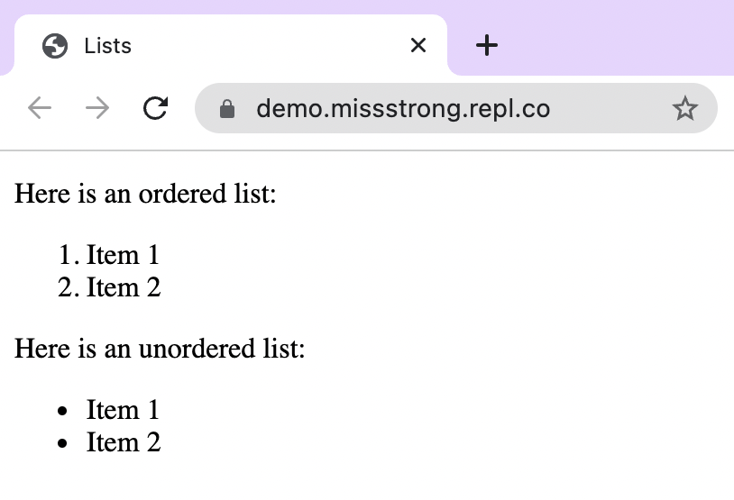

### Lists

**Ordered lists** are lists with numbered items whereas **unordered lists** are lists with bulleted items. We can create an ordered list with the `<ol>` tag and an unordered list with the `<ul>` tag. The items within either type of list use `<li>` tags.

```html
<!DOCTYPE html>
<html lang="en">
  <head>
    <title>Lists</title>
  </head>
  <body>
    <p>Here is an ordered list:</p>
    <ol>
      <li>Item 1</li>
      <li>Item 2</li>
    </ol>
    <p>Here is an unordered list:</p>
    <ul>
      <li>Item 1</li>
      <li>Item 2</li>
    </ul>
  </body>
</html>
```


