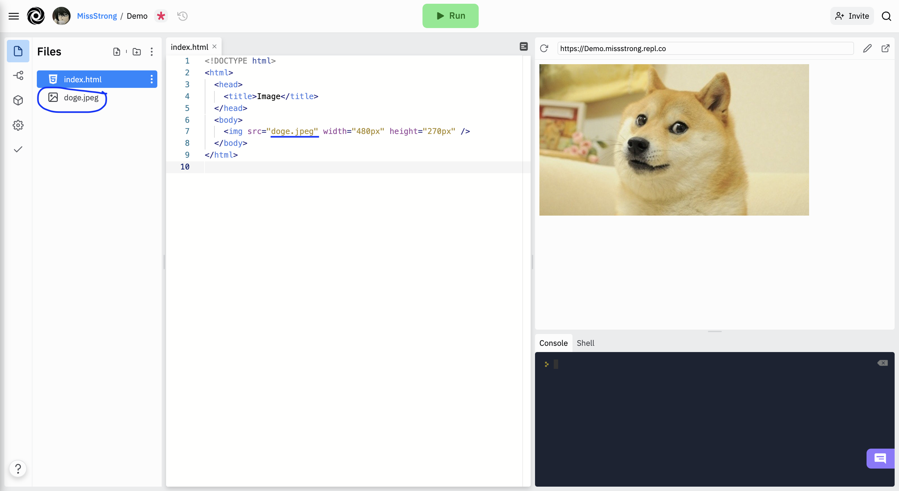

### Self-Closing Tags

All of the opening tags we've seen have a closing tag to match it. There are also **self-closing tags** that don't require a separate closing tag.

Here are some examples:
* `<br />` is a line break (it puts vertical space between content)
* `<hr />` is a horizontal rule (a black horizontal line that goes across the page)
* `` is for images

The forward slash `/` at the end are optional, but it is conventional to put them in to remind ourselves that they don't need a separate closing tag.


### Images

To display an image, we use the self-closing `` tag. The location of the image is called an **image source**. The attribute for an image source is `src`. 

If the image is already on the Internet, we can use the image's URL. We can get the URL by right-clicking on the image and selecting *Copy Image Address*.


```html
<!DOCTYPE html>
<html>
  <head>
    <title>Image</title>
  </head>
  <body>
    />
  </body>
</html>
```


We can also modify the width and height of an image using the `width` and `height` attributes.

```html
<!DOCTYPE html>
<html>
  <head>
    <title>Image</title>
  </head>
  <body>
    />
  </body>
</html>
```


If we are uploading the image ourselves and the image file is in the same folder as the HTML file, we just need to write the filename. 

```html
<!DOCTYPE html>
<html>
  <head>
    <title>Image</title>
  </head>
  <body>
    
  </body>
</html>
```



If the image is in a folder then we need to specify the filepath. We write the folder name followed by a forward slash followed by the filename.


```html
<!DOCTYPE html>
<html>
  <head>
    <title>Image</title>
  </head>
  <body>
    
  </body>
</html>
```


