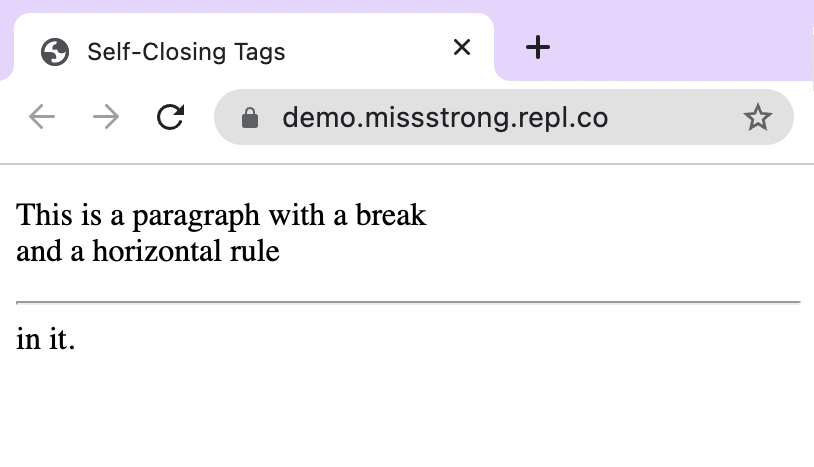

### Self-Closing Tags

All of the opening tags we've seen have a closing tag to match it. There are also **self-closing tags** that don't require a separate closing tag.

Here are some examples:
* `<br />` is a line break (it puts vertical space between content).
* `<hr />` is a horizontal rule (a black horizontal line that goes across the page).
* `<meta />` is for metadata within the header.

The forward slash `/` at the end is optional, but it is conventional to put them in to remind ourselves that we don't need a separate closing tag.

```html
<!DOCTYPE html>
<html lang="en">
  <head>
    <meta charset="utf-8" />
    <meta name="viewport" content="width=device-width" />
    <title>Self-Closing Tags</title>
  </head>
  <body>
    <p>This is a paragraph with a break<br /> and a horizontal rule<hr />in it.</p>
  </body>
</html>
```


The line `<meta charset="utf-8" />` allows all Unicode characters to display correctly on the webpage. Without this line, some symbols might not show up or might show up as just a □.

The line `<meta name="viewport" content="width=device-width" />` modifies the webpage so that it fits the dimensions of the device you're using to make it look better. This is helpful for viewing webpages on phones and tablets.
