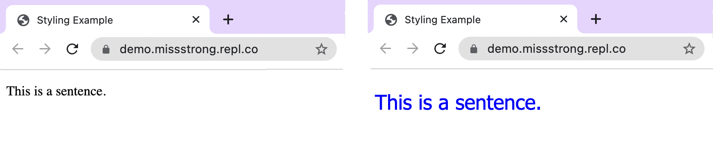
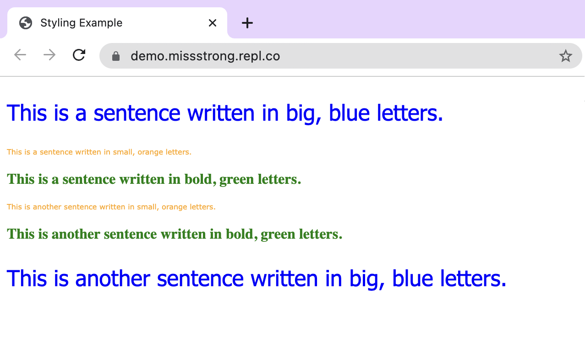

### CSS Basics

A CSS file can be used to add styling to a webpage. CSS stands for Cascade Style Sheet.

To link a CSS file to an HTML file, we use the self-closing `<link>` tag and the following attributes:
* `href` (hypertext reference – the name of the css file, usually `style.css`)
* `rel` (relationship – the connection between the HTML and CSS file, `stylesheet`)
* `type` (file type – the filetype of the CSS file `text/css`)

This line goes in the header.

```html
<!DOCTYPE html>
<html lang="en">
  <head>
    <title>Title</title>
    <link href="style.css" rel="stylesheet" type="text/css" />
  </head>
  <body>
  </body>
</html>
```

Within a CSS file, we can specify the styling we want to apply to specific tags. We start by writing the name of the tag without the angular brackets. Then we put a set of curly braces `{}` after it and put the styling inside these braces. The syntax for each styling is `property: value;`.

Here is [a list of the most common properties](https://developer.mozilla.org/en-US/docs/Web/CSS/CSS_Properties_Reference). We can click on a property to find the list of its possible values.

For example, here's how we can make all the text within a `<p>` tag use the Tahoma font with a font size of 24 and a font colour of blue.

```css
p {
  color: blue;
  font-family: Tahoma;
  font-size: 24px;
}
```

On the left is text without any styling and on the right is text that uses the styling above. 



### IDs

If we want to apply styling to a specific element, we can add an `id` attribute to the element in the HTML file. IDs are unique, so we cannot use the same ID more than once in different elemetns.

```html
<!DOCTYPE html>
<html lang="en">
  <head>
    <title>Styling Example</title>
    <link href="style.css" rel="stylesheet" type="text/css" />
  </head>
  <body>
    <div>
      <p id="big-blue">This is a sentence.</p>
    </div>
  </body>
</html>
```

In the CSS file, instead of writing the tag name, we put a hash `#` followed by the id.

```css
#big-blue {
  color: blue;
  font-family: Tahoma;
  font-size: 24px;
}
```

### Classes

If we want to apply styling to a specific set of elements, we can add a `class` attribute to the elements in the HTML file. This will group them together so that we can apply a styling to all of them at once.

```html
<!DOCTYPE html>
<html lang="en">
  <head>
    <title>Styling Example</title>
    <link href="style.css" rel="stylesheet" type="text/css" />
  </head>
  <body>
    <div>
      <p class="big-blue">This is a sentence written in big, blue letters.</p>
      <p class="small-orange">This is a sentence written in small, orange letters.</p>
      <p class="bold-green">This is a sentence written in bold, green letters.</p>
      <p class="small-orange">This is another sentence written in small, orange letters.</p>
      <p class="bold-green">This is another sentence written in bold, green letters.</p>
      <p class="big-blue">This is another sentence written in big, blue letters.</p>
    </div>
  </body>
</html>
```

In the CSS file, we put a dot `.` followed by the class.

```css
.big-blue {
  color: blue;
  font-family: Tahoma;
  font-size: 24px;
}

.small-orange {
  color: orange;
  font-family: Verdana;
  font-size: 8px;
}

.bold-green {
  color: green;
  font-family: Garamond;
  font-weight: bold;
}
```


