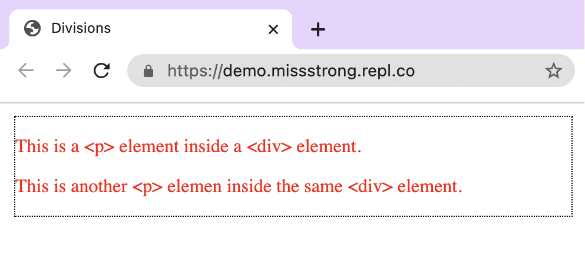
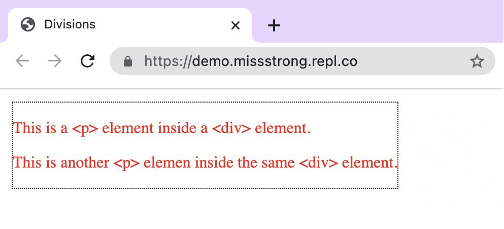

### Divisions

We can use `<div>` (division) tag to separate a webpage into sections. This allows us to group elements together and style them accordingly.

Here is an example:



```html
<!DOCTYPE html>
<html lang="en">
  <head>
    <title>Divisions</title>
    <link href="style.css" rel="stylesheet" type="text/css" />
  </head>
  <body>
    <div id="section1">
      <p>This is a &lt;p&gt; element inside a &lt;div&gt; element</p>
      <p>This is another &lt;p&gt; elemen inside the same &lt;div&gt; element</p>
    </div>
  </body>
</html>
```

The `&lt;` (the less than symbol) and `&gt;` (the greater than symbol) are used instead of `<` and `>` since otherwise it would be interpretted as a tag.


```css
#section1 {
  border-color: black;
  border-style: dotted;
  border-width: thin;
  color: red;
  margin: 5px;
}
```

By default, `<div>` elements take up the entire width of the webpage. If we want it to take up only as much width as it needs, we can add `float: left;` in the CSS property.





### Spans

We can also use a <span> tag to separate a webpace into sections. The main difference between <div> and <span> is that browsers automatially put a line break before and after a <div> element whereas they do not do this for <span> elements.
