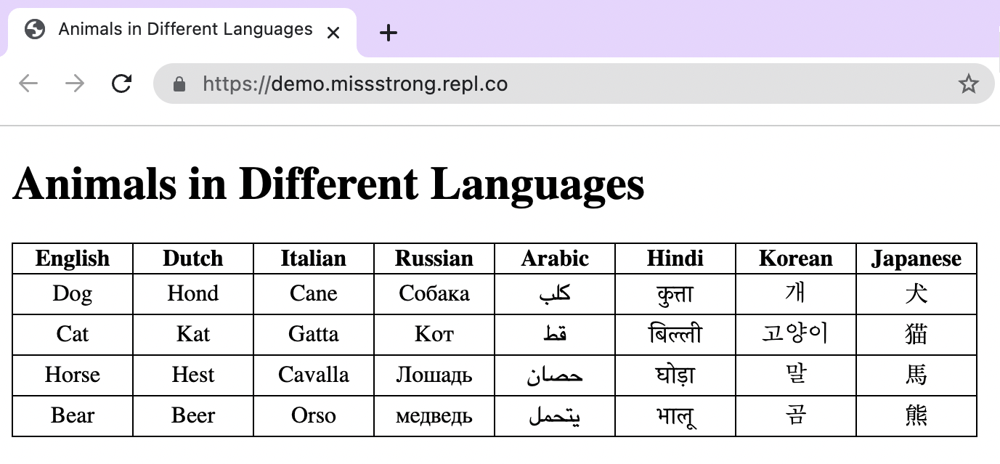

### Tables

Tables use `<table>` tags. Every row in the table uses `<tr>` (table row) tags. Each cell in the first row should use `<th>` (table header) tags if the first row is a header and all the cells should use `<td>` (table data) tags.

```html
<!DOCTYPE html>
<html lang="en">
  <head>
    <meta charset="utf-8" />
    <title>Animals in Different Languages</title>
  </head>
  <body>
    <h1>Animals in Different Languages</h1>
    <table>
      <tr>
        <th>English</th>
        <th>Dutch</th> 
        <th>Italian</th> 
        <th>Russian</th> 
        <th>Arabic</th> 
        <th>Hindi</th>   
        <th>Korean</th> 
        <th>Japanese</th> 
      </tr>
      <tr>
        <td>Dog</td>
        <td>Hond</td>
        <td>Cane</td>
        <td>Собака</td>
        <td>كلب</td>
        <td>कुत्ता</td>
        <td>개</td>
        <td>犬</td>
      </tr>
      <tr>
        <td>Cat</td> 
        <td>Kat</td>
        <td>Gatta</td>
        <td>Кот</td>
        <td>قط</td>
        <td>बिल्ली</td>
        <td>고양이</td>
        <td>猫</td>
      </tr>
      <tr>
        <td>Horse</td> 
        <td>Hest</td>
        <td>Cavalla</td>
        <td>Лошадь</td>
        <td>حصان</td>
        <td>घोड़ा</td>
        <td>말</td>
        <td>馬</td>
      </tr>
      <tr>
        <td>Bear</td> 
        <td>Beer</td>
        <td>Orso</td>
        <td>медведь</td>
        <td>يتحمل</td>
        <td>भालू</td>
        <td>곰</td>
        <td>熊</td>
      </tr>
    </table>
  </body>
</html>
```


We can change the properties of the table in the CSS file.

```css
table, th, td {  /* We can apply the same styling to different tags by combining them one one line and separating them by commas */
  border: 1px solid black;  /* This is a combination of border-width, border-style and border-color */
  border-collapse: collapse;  /* This merges all the double borders */
  text-align: center; /* This centers the text */
}

th {
  width: 80px; /* This makes the width of all the columns 80 pixels*/
}
```


