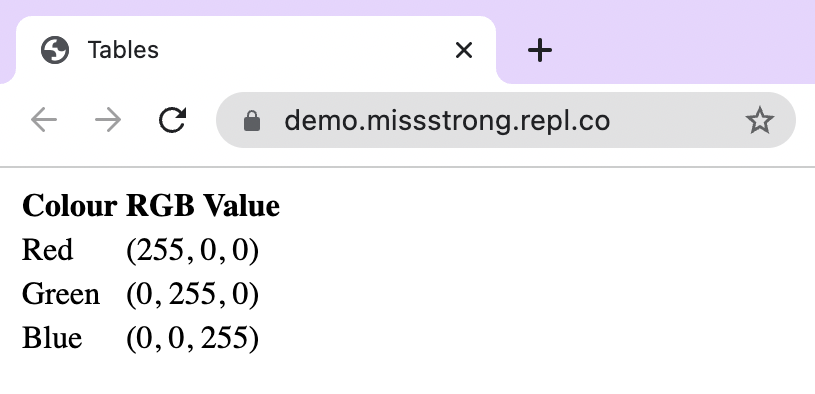
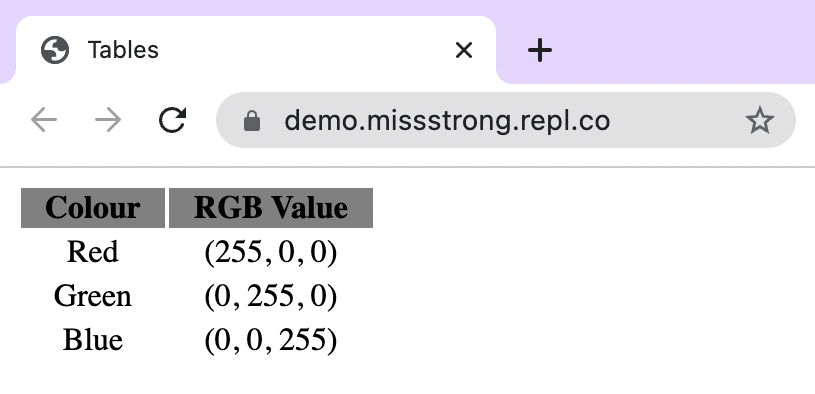

### Tables

Tables use `<table>` tags. Every row in the table uses `<tr>` (table row) tags. Each cell in the first row should use `<th>` (table header) tags if the first row is a header and all the cells should use `<td>` (table data) tags.

```html
<!DOCTYPE html>
<html lang="en">
  <head>
    <title>Tables</title>
  </head>
  <body>
    <table>
      <tr>
        <th>Colour</th>
        <th>RGB Value</th> 
      </tr>
      <tr>
        <td>Red</td>
        <td>(255, 0, 0)</td>
      </tr>
      <tr>
        <td>Green</td> 
        <td>(0, 255, 0)</td> 
      </tr>
      <tr>
        <td>Blue</td> 
        <td>(0, 0, 255)</td>
      </tr>
    </table>
  </body>
</html>
```



We can change some of the properties of the table using attributes. Here are a few examples:
* The `align` attribute changes the horizontal text alignment. By default, `<th>` tags have centered text and `<tr>` tags have left-aligned text. The values for `align` include `left`, `right`, and `center`.
* The `width` attribute changes the horizontal length of the cell. The values are strings that contain the number of pixels followed by `px`.
* The `height` attribute changes the vertical length of the cell. The values are strings that contain the number of pixels followed by `px`.
* The `bgcolour` attribute changes the background colour of the cell. The values are strings that are either hexadecimal values or [colour names](https://www.w3schools.com/colors/colors_names.asp).
  
```html
<!DOCTYPE html>
<html lang="en">
  <head>
    <title>Tables</title>
  </head>
  <body>
    <table>
      <tr bgcolor="grey">
        <th width="70px">Colour</th>
        <th width="100px">RGB Value</th> 
      </tr>
      <tr align="center">
        <td>Red</td>
        <td>(255, 0, 0)</td>
      </tr>
      <tr align="center">
        <td>Green</td> 
        <td>(0, 255, 0)</td> 
      </tr>
      <tr align="center">
        <td>Blue</td> 
        <td>(0, 0, 255)</td>
      </tr>
    </table>
  </body>
</html>
```


