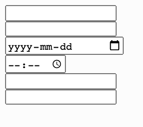
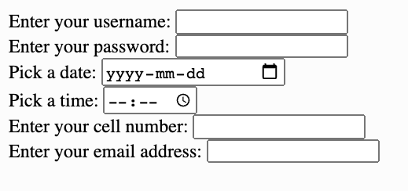
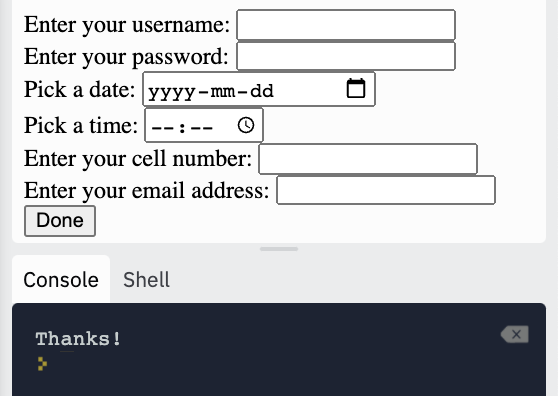
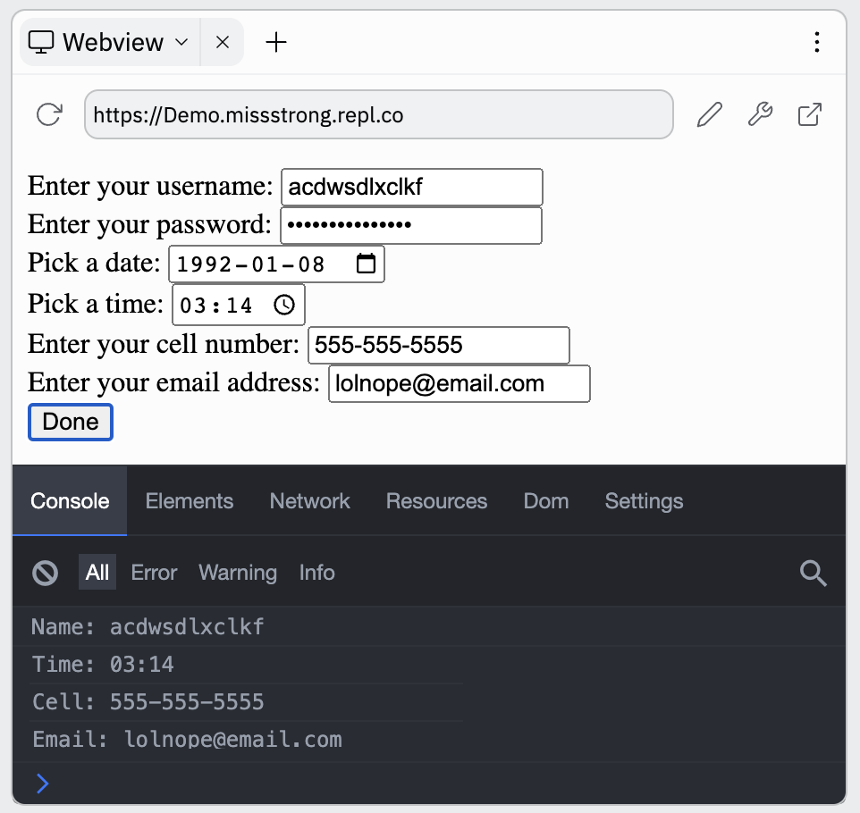

### User Input

We can create input fields for users to enter information into. We start by using `<form>` tags to indicate a section of input fields and inside it we use   `<input>` (self-closing) tags for each input field. The `<input>` tag has an attribute called `type` which indicates what type of input field it is.

```html
<!DOCTYPE html>
<html lang="en">
  <head>
    <title>User Input</title>
  </head>
  <body>
    <form>
      <input type="text" />
      <br />
      <input type="password" />
      <br />
      <input type="date" />
      <br />
      <input type="time" />
      <br />
      <input type="tel" />
      <br />
      <input type="email" />
      <br />
    </form>
  </body>
</html>
```



We can add labels to each input field to make it clear what each one is for. The `<label>` tag has an attribute `for` which is used to show which element it labels based on its `id`. The `for` attribute allows the user to click on the label to get the cursor into the field and allows to screen readers to read the page aloud more accurately.

```html
<!DOCTYPE html>
<html lang="en">
  <head>
    <title>User Input</title>
  </head>
  <body>
    <form>
      <label for="name">Enter your username:</label>
      <input type="text" id="name" />
      <br />
      <label for="password">Enter your password:</label>
      <input type="password" id="password" />
      <br />
      <label for="date" >Pick a date:</label>
      <input type="date" id="date" />
      <br />
      <label for="time">Pick a time:</label>
      <input type="time" id="time" />
      <br />
      <label for="cell">Enter your cell number:</label>
      <input type="tel" id="cell" />
      <br />
      <label for="email">Enter your email address:</label>
      <input type="email" id="email" />
      <br />
    </form>
  </body>
</html>
```



Another `type` of `<input>` is `"button"`, which we can put so that the user can indicate that they're done entering the information. This tag has an attribute `value` for the text to display on the button and an attribute `onclick` for the code to run when the user clicks the button.

We'll also want to add the attribute `onsubmit="return false;"` to the `form` tag to prevent the page from sending the information to a server (which reloads the page in Replit).

```html
<!DOCTYPE html>
<html lang="en">
  <head>
    <title>User Input</title>
  </head>
  <body>
    <form onsubmit="return false;">
      <label for="name">Enter your username:</label>
      <input type="text" id="name" />
      <br />
      <label for="password">Enter your password:</label>
      <input type="password" id="password" />
      <br />
      <label for="date" >Pick a date:</label>
      <input type="date" id="date" />
      <br />
      <label for="time">Pick a time:</label>
      <input type="time" id="time" />
      <br />
      <label for="cell">Enter your cell number:</label>
      <input type="tel" id="cell" />
      <br />
      <label for="email">Enter your email address:</label>
      <input type="email" id="email" />
      <br />
      <input type="button" value="Done" onclick="console.log('Thanks');">
    </form>
  </body>
</html>
```



If we want to access the information from the fields that were entered, we can use the `value` field on the element object.

```html
<!DOCTYPE html>
<html lang="en">
  <head>
    <title>User Input</title>
    <script src="script.js"></script>
  </head>
  <body>
    <form onsubmit="return false;">
      <label for="name">Enter your username:</label>
      <input type="text" id="name" />
      <br />
      <label for="password">Enter your password:</label>
      <input type="password" id="password" />
      <br />
      <label for="date" >Pick a date:</label>
      <input type="date" id="date" />
      <br />
      <label for="time">Pick a time:</label>
      <input type="time" id="time" />
      <br />
      <label for="cell">Enter your cell number:</label>
      <input type="tel" id="cell" />
      <br />
      <label for="email">Enter your email address:</label>
      <input type="email" id="email" />
      <br />
      <input type="button" value="Done" onclick="recap();">
    </form>
  </body>
</html>
```

```js
// This is in the script.js file

function recap() {
  let name = document.getElementById("name").value;
  let time = document.getElementById("time").value;
  let cell = document.getElementById("cell").value;
  let email = document.getElementById("email").value;
  console.log("Name: " + name);
  console.log("Time: " + time);
  console.log("Cell: " + cell);
  console.log("Email: " + email);
}
```


