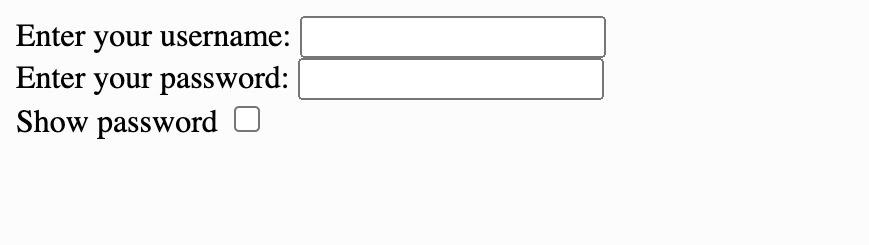
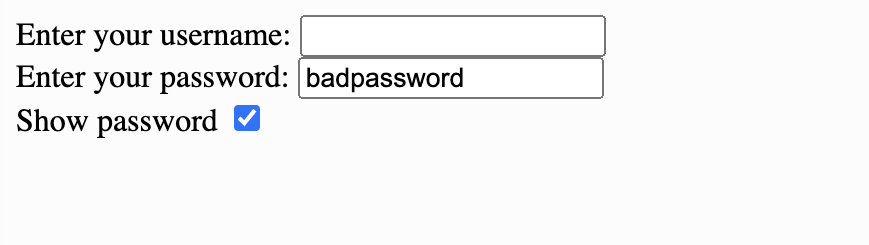

### Checkboxes

We can create checkboxes using an `<input>` tag with `type="checkbox"`.

```html
<!DOCTYPE html>
<html lang="en">
  <head>
    <title>User Input</title>
  <body>
    <form>
      <label for="name">Enter your username:</label>
      <input type="text" id="name" />
      <br />
      <label for="user-password">Enter your password:</label>
      <input type="password" id="user-password" />
      <br />
      <label for="show-password">Show Password</label>
      <input type="checkbox" id="show-password"/>
    </form>
  </body>
</html>
```



If we want to make something happen when we check off the box, we can use the `onclick` attribute. This allows us to call a function whenever the checkbox is checked or unchecked. The `checked` property will be `true` when the checkbox is checked off and `false` when it's unchecked.

```html
<!DOCTYPE html>
<html lang="en">
  <head>
    <title>User Input</title>
    <script src="script.js"></script>
  </head>
  <body>
    <form>
      <label for="name">Enter your username:</label>
      <input type="text" id="name" />
      <br />
      <label for="user-password">Enter your password:</label>
      <input type="password" id="user-password" />
      <br />
      <label for="show-password">Show Password</label>
      <input type="checkbox" id="show-password" onclick="togglePassword()"; />
    </form>
  </body>
</html>
```

```js
// This is in the script.js file

function togglePassword() {
  let passwordCheckbox = document.getElementById("show-password");
  let passwordField= document.getElementById("user-password");
  if (passwordCheckbox.checked) { // checkbox is checked
    passwordField.type = "text"; // password goes from showing to not showing
  } else { // checkbox is unchecked
    passwordField.type = "password"; // password goes from not showing to showing
  }
}
```


