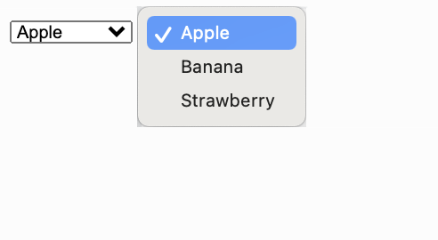
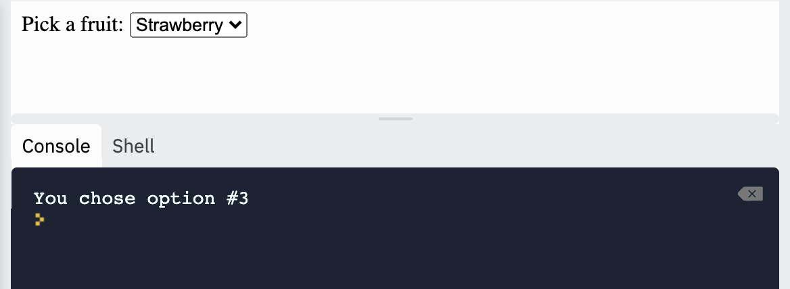
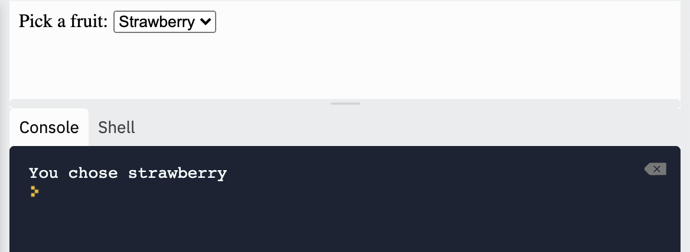

### Dropdown Menus

We can create dropdown menus for users to choose an option. We start by using `<form>` tags, inside it we use `<select>` tags, then we use `<option>` tags for each option in the dropdown menu.

```html
<!DOCTYPE html>
<html>
  <head>
    <title>Dropdown Menu</title>
  </head>
  <body>
    <form>
      <select>
        <option>Apple</option>
        <option>Banana</option>
        <option>Strawberry</option>
      </select>
    </form>
  </body>
</html>
```



If we want something to happen when we select an option, we can use the `onchange` attribute in `<select>`. This allows us to call a function whenever an option is selected.

To determine which option was selected, we can access the `selectedIndex` property on a `<select>` object.

```html
<!DOCTYPE html>
<html>
  <head>
    <title>Dropdown Menu</title>
    <link href="style.css" rel="stylesheet" type="text/css" />
    <script src="script.js"></script>
  </head>
  <body>
    <form>
      <label for="fruit-menu">Pick a fruit:</label>
      <select id="fruit-menu" onchange="sayOption();">
        <option>Apple</option>
        <option>Banana</option>
        <option>Strawberry</option>
      </select>
    </form>
  </body>
</html>
```


```js
// This is in the script.js file

function sayOption() {
  let fruitMenu = document.getElementById("fruit-menu");
  let index = fruitMenu.selectedIndex + 1;
  console.log("You chose option #" + index);
}
```



If we want to see the name of the option that was selected, we can add a `value` attribute to each `<option>` and access the `value` property of the `<option>` object. 

A `<select>` object is actually an array, so we can access the selected `<option>` object using the index.

```html
<!DOCTYPE html>
<html>
  <head>
    <title>Dropdown Menu</title>
    <link href="style.css" rel="stylesheet" type="text/css" />
    <script src="script.js"></script>
  </head>
  <body>
    <form>
      <label for="fruit-menu">Pick a fruit:</label>
      <select id="fruit-menu" onchange="sayFruit();">
        <option value="apple">Apple</option>
        <option value="banana">Banana</option>
        <option value="strawberry">Strawberry</option>
      </select>
    </form>
  </body>
</html>
```

```js
function sayFruit() {
  let fruitMenu = document.getElementById("fruit-menu");
  let index = fruitMenu.selectedIndex;
  let fruit = fruitMenu[index].value;
  console.log("You chose " + fruit);
}
```


