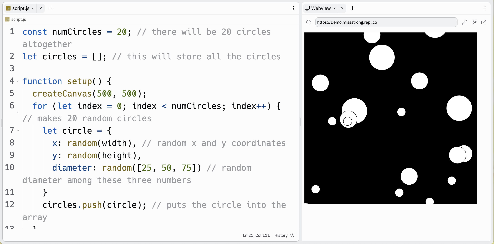

# [Link to video.]()

### Using Arrays to Store Custom Objects

If we wanted several shapes with different properties on our canvas, we can use an array to keep track of each individual one.

For example, this program shows 20 different circles "falling" down.

```js
const numCircles = 20; // there will be 20 circles altogether
let circles = []; // this will store all the circles

function setup() {
  createCanvas(500, 500);
  for (let index = 0; index < numCircles; index++) { // makes 20 random circles
    let circle = {
      x: random(width), // random x and y coordinates
      y: random(height),
      diameter: random([25, 50, 75]) // random diameter among these three numbers
    }
    circles.push(circle); // puts the circle into the array
  }
}

function draw() {
  background(0);
  for (let circle of circles) { // goes through each of the 20 circles
    ellipse(circle.x, circle.y, circle.diameter); 
    circle.y++; // increases the y coordinate so that it looks like the circle is falling
    if (circle.y - circle.diameter/2 > 500) { // when the circle falls off the screen, it goes back to the top
      circle.y = -circle.diameter/2;
    }
  }
}
```



